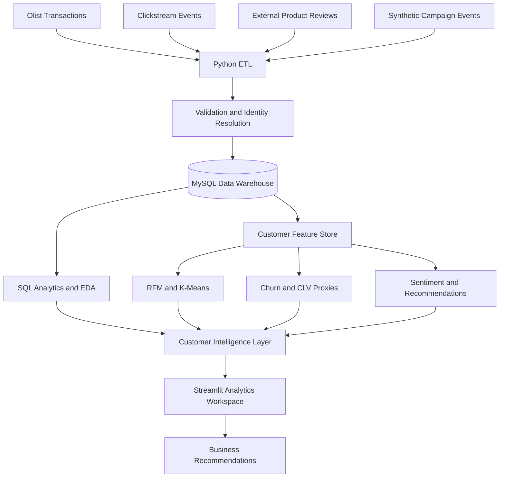
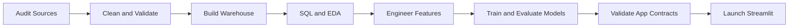

# Customer 360 Intelligence Platform

### From fragmented customer data to actionable retention, value, and growth intelligence

[](https://www.python.org/)
[](https://www.mysql.com/)
[](https://streamlit.io/)
[](https://scikit-learn.org/)
[](#future-improvements)

---

## Project Overview

Customer 360 Intelligence Platform is an end-to-end analytics solution that combines customer transactions, digital behavior, campaign response, and product feedback. It establishes a canonical customer identity, organizes data in a MySQL dimensional warehouse, and creates one analysis-ready customer feature store. The platform supports RFM analysis, behavioral segmentation, churn and customer-value modeling, sentiment intelligence, and explainable recommendations. Business users access the results through a responsive Streamlit workspace with customer search, interactive filters, prediction tools, SQL insights, and downloadable reports. Synthetic and proxy elements are explicitly labeled so demonstrated architecture is never presented as observed business performance.

---

## Business Problem

Customer information is usually distributed across sales, web analytics, marketing, CRM, support, and review systems. Teams see only part of the customer journey, which creates inconsistent metrics and slows decisions.

This fragmentation makes it difficult to answer:

- Who are the most valuable and loyal customers?
- Which customers show signs of inactivity?
- Which segments should receive retention or growth campaigns?
- Which products and categories create poor experiences?
- Which offer or category should be recommended next?
- Which campaigns produce the strongest response and ROI?

---

## Solution Overview

The platform keeps each source at a credible analytical grain instead of forcing unrelated records into one flat file:

- Olist provides the canonical customer, transaction, payment, product, and customer-rating records.
- Clickstream data demonstrates web engagement through a clearly marked simulated identity map.
- Amazon/Datafiniti reviews remain a separate product-sentiment module and are not joined to Olist customers.
- Marketing events are synthetic and demonstrate campaign funnel and ROI analysis.
- Python notebooks perform auditing, ETL, EDA, feature engineering, modeling, and release validation.
- MySQL and Streamlit provide governed analytics and an accessible business workspace.

All source monetary values are displayed in Brazilian reais: `R$` is the currency symbol and `BRL` is the ISO currency code. No INR conversion is performed.

---

## System Architecture



---

## Tech Stack

| Layer | Technologies |
|---|---|
| Programming and analysis | Python, Pandas, NumPy |
| Database and SQL | MySQL 8.0, SQL, SQLAlchemy, PyMySQL |
| Machine learning | Scikit-learn, Random Forest, K-Means, Logistic Regression |
| NLP and recommendations | TF-IDF, basket co-occurrence, popularity fallback |
| Visualization | Plotly, Matplotlib, Seaborn, WordCloud |
| Application | Streamlit, ReportLab |
| Development | Jupyter Notebook, Git, GitHub |
| Planned model benchmarks | XGBoost, NLTK-based preprocessing |

XGBoost and NLTK are roadmap benchmarks, not dependencies of the current saved models.

---

## Dataset Overview

| Dataset | Business purpose | Integration rule |
|---|---|---|
| Olist Brazilian E-Commerce | Customers, transactions, products, payments, ratings | Customer-level source of truth using `customer_unique_id` |
| E-Commerce Events History | Sessions, views, carts, and purchases | Simulated identity mapping for behavior demonstration |
| Amazon/Datafiniti Consumer Reviews | Product rating and review sentiment | External category intelligence; no Olist customer join |
| Marketing Campaign Data | Opens, clicks, conversions, revenue, and cost | Synthetic events marked at row level |

The available sources do not include names, email addresses, age, true discounts, or support tickets. These fields are not fabricated.

---

## Key Features

### Customer 360 Profile

Search a canonical customer and review location, spend, orders, favorite category, digital engagement, campaign response, feedback, purchase timeline, churn propensity, CLV proxy, recommended action, and next-best categories. Profiles can be exported to CSV or PDF.

### RFM Segmentation

Scores recency, frequency, and monetary value to identify Champions, Loyal Customers, Potential Loyalists, At Risk, Lost Customers, and Regular Customers. The segments translate transaction history into clear retention and growth audiences.

### Customer Segmentation

Uses standardized K-Means clustering and profile-based cluster naming to identify High Value, Inactive, Digitally Engaged, Growth Potential, and Regular Buyer groups.

### CLV Prediction

Estimates a calibrated 12-month forward-revenue proxy using recency, frequency, spend, average order value, product breadth, and customer purchase span. The dashboard provides a value band, model interval, and recommended commercial action.

### Churn Prediction

Produces a calibrated churn-propensity score, Low/Medium/High risk band, global model drivers, probability gauge, and suggested retention strategy. Olist has no observed churn label, so this is explicitly presented as a portfolio proxy.

### Sentiment Analysis

Classifies review text using TF-IDF and Logistic Regression. The application includes sentiment mix, trends, review exploration, category summaries, complaint and praise phrases, and an on-demand word cloud.

### Recommendation System

Recommends categories using basket co-occurrence with a popular-category fallback. Every recommendation includes its rank, method, and reason to keep cross-sell suggestions explainable.

---

## Project Workflow



The six notebooks must be run in sequence because each stage validates and produces inputs for the next stage.

---

## Repository Structure

```text
Customer 360 Intelligence/
|-- .streamlit/config.toml
|-- datasets/                              # Original source CSV files
|-- data/processed/                        # Warehouse and application outputs
|-- models/                                # Serialized ML pipelines
|-- notebooks/
|   |-- 01_Data_Audit.ipynb
|   |-- 02_MySQL_Warehouse_ETL.ipynb
|   |-- 03_SQL_EDA.ipynb
|   |-- 04_Feature_Engineering.ipynb
|   |-- 05_ML_Models.ipynb
|   `-- 06_Streamlit_Data_Preparation.ipynb
|-- sql/
|   |-- schema.sql
|   `-- analytics_queries.sql
|-- streamlit_app/app.py
|-- requirements.txt
`-- README.md
```

---

## Dashboard Preview

The Streamlit workspace contains seven focused destinations:

| Page | Purpose |
|---|---|
| Overview | Animated KPIs, segment revenue, geographic performance, value and recency |
| Customer Explorer | Unified profile, journey, timeline, retention action, recommendations |
| Segments | RFM distribution, behavior clusters, revenue contribution, drill-downs |
| Predictions | Churn gauge, CLV proxy, value band, interval, model drivers |
| Experience | Sentiment intelligence, review themes, campaign funnel and ROI |
| Recommendations | Next-best category, frequently bought together, product performance |
| Data & SQL | Artifact health, predefined analyses, pagination, SQL and report exports |

<!-- Replace these comments with real images after capturing the running application.


-->

Recommended captures: Executive Overview, Customer Explorer, Segments, Predictions, and Experience at `1440 x 900`.

---

## Key Business Insights / Results

- Created **94,983** app-ready canonical customer profiles from the Olist transaction history.
- Modeled **112,650** order-item records and sampled **300,000** clickstream events.
- Integrated **99,224** Olist customer reviews and **34,660** external product reviews without invalid customer joins.
- Generated **474,915** explainable category recommendations for **94,983** customers.
- Identified customer value and retention audiences through RFM rules and five behavioral clusters.
- Churn proxy evaluation produced `0.665 ROC-AUC` on a held-out split with a calibrated `40.2%` synthetic class rate.
- CLV proxy evaluation produced `0.917 R^2` and `BRL 38.26 MAE` against the calibrated demonstration target.
- Replaced repeated notebook-only interpretation with reusable SQL, customer search, interactive analysis, and downloadable reports.

The model metrics measure recovery of proxy targets, not real production churn reduction or revenue lift.

---

## Installation

### 1. Clone and create the environment

```powershell
git clone <your-repository-url>
cd "Customer 360 Intelligence"
python -m venv .venv
.venv\Scripts\Activate.ps1
python -m pip install --upgrade pip
pip install -r requirements.txt
```

### 2. Prepare MySQL

Open `sql/schema.sql` in MySQL Workbench and execute the complete script. In Notebook 02, set `LOAD_TO_MYSQL = True` only when a MySQL load is required.

### 3. Run the notebooks

```powershell
jupyter notebook
```

Run notebooks `01` through `06` in filename order using **Restart Kernel and Run All Cells**. Notebook 06 must report `Release checks passed.`

### 4. Launch the application

```powershell
streamlit run streamlit_app/app.py
```

Open `http://localhost:8501`.

---

## Future Improvements

- Replace simulated identity mappings and campaigns with consented source-system records.
- Train on observed churn and future-revenue labels and benchmark XGBoost.
- Add SHAP explanations and customer-level reason codes.
- Implement incremental orchestration, drift monitoring, and automated retraining.
- Add authenticated APIs, role-based access, privacy controls, and audit logging.
- Package with Docker, CI/CD, automated tests, and cloud deployment.

---

## Author

**Suhani Chauhan**  
Data Analyst | Customer Analytics | SQL | Python | Machine Learning

- GitHub: `https://github.com/suhani-chauhan56`
- LinkedIn: `https://www.linkedin.com/in/suhani-chauhan-`


Replace the author placeholders and `https://github.com/suhani-chauhan56/Customer-360-Intelligence-Platform` before publishing the repository. 
