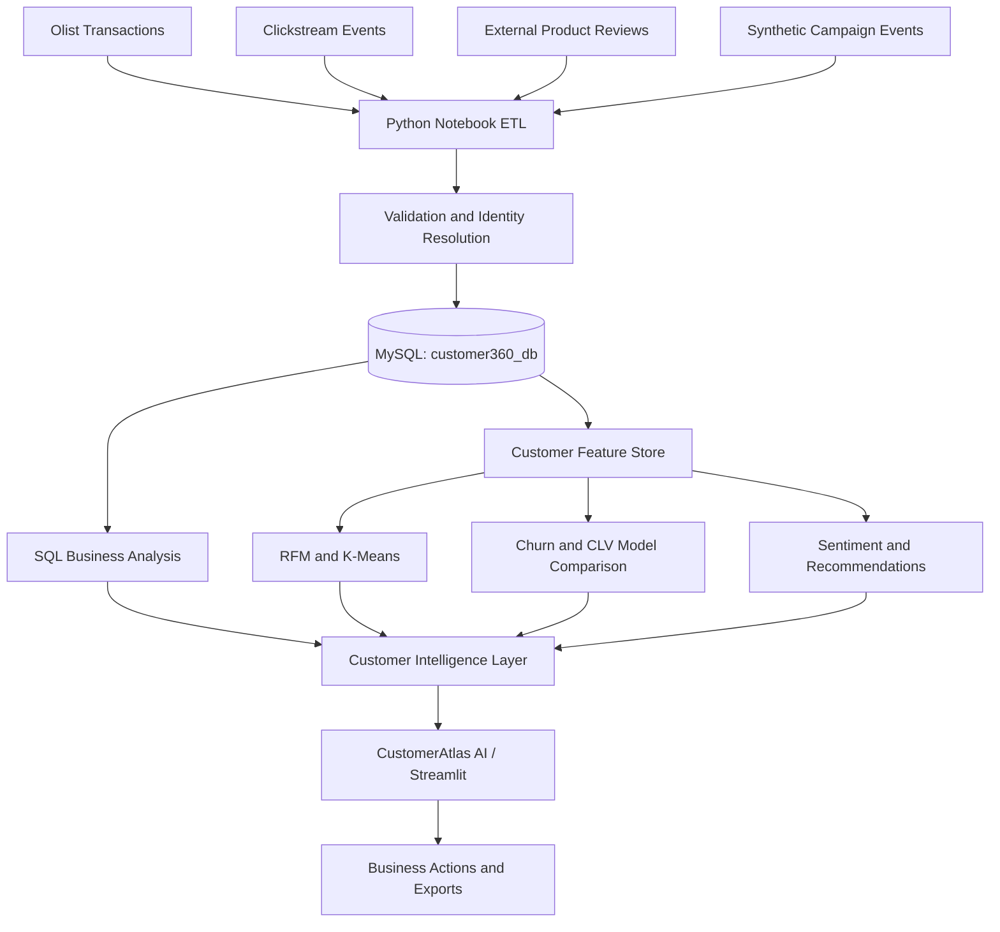
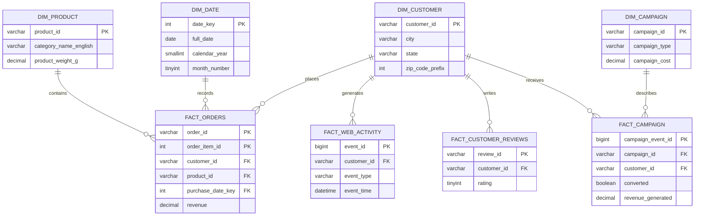
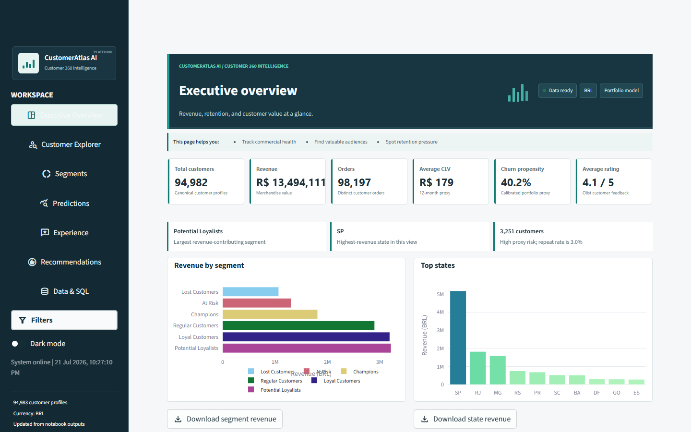
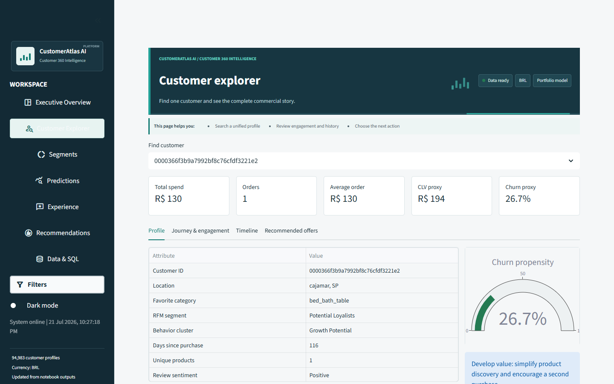
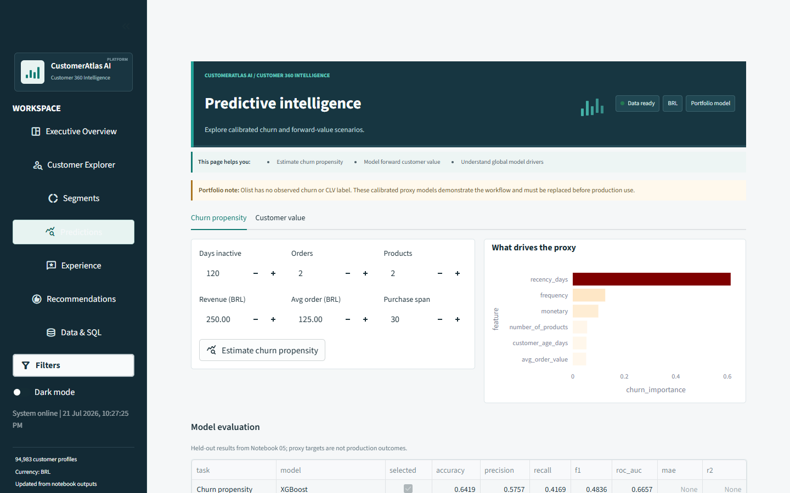
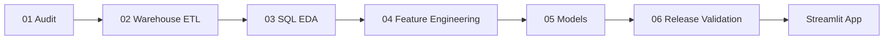

# Customer 360 Intelligence Platform

> Unifying transactions, digital behavior, campaign response, and customer feedback into actionable retention and growth intelligence.

[](https://www.python.org/)
[](https://www.mysql.com/)
[](https://streamlit.io/)
[](https://xgboost.ai/)
[](#limitations)

---

## Project Overview

CustomerAtlas AI is an end-to-end customer analytics platform built for an e-commerce business. It creates a canonical customer identity, organizes multiple sources in a MySQL dimensional warehouse, engineers one customer-level feature store, and exposes decision-ready analytics through Streamlit.

The platform answers practical questions about customer value, retention risk, engagement, sentiment, campaign response, and next-best-category recommendations. Synthetic mappings and proxy targets are labeled throughout the notebooks, warehouse, app, and documentation so demonstration outputs are not presented as observed production performance.

### STAR Summary

| Stage | Delivery |
|---|---|
| **Situation** | Customer, transaction, web, campaign, and review data existed at different grains with incompatible identities. |
| **Task** | Build one governed customer view for revenue, retention, experience, and cross-sell decisions. |
| **Action** | Audited the sources, designed a dimensional warehouse, resolved canonical identities, engineered features, compared models, and built a seven-page Streamlit workspace. |
| **Result** | Delivered 94,983 searchable profiles, reusable SQL analysis, customer segments, risk/value indicators, recommendations, and downloadable reports. |

---

## Business Problem

Sales, website, marketing, and feedback teams often use disconnected systems. Without a shared customer layer, the business cannot reliably determine:

- Which customers and regions generate the most revenue?
- Which audiences should receive loyalty, growth, or win-back treatment?
- Which customers show signals associated with inactivity?
- How do delivery and product experiences affect customer ratings?
- Which categories should be recommended next?
- Which campaigns move customers from open to conversion?

---

## Solution

- Treat Olist `customer_unique_id` as the canonical customer identifier.
- Preserve source-specific grains instead of creating one oversized flat file.
- Store dimensions and facts in the `customer360_db` MySQL warehouse.
- Join clickstream behavior through a clearly marked simulated identity map.
- Keep Amazon/Datafiniti reviews as separate product intelligence, never as Olist customer behavior.
- Generate and label synthetic campaign events where no observed source exists.
- Build RFM, clustering, churn-proxy, CLV-proxy, sentiment, and recommendation outputs.
- Deliver the results in a responsive Streamlit application with filters, search, exports, and business actions.

All monetary values are displayed in Brazilian reais. `R$` is the display symbol and `BRL` is the ISO currency code.

---

## Architecture



### Warehouse Schema



The full DDL is available in [`sql/schema.sql`](sql/schema.sql). Ten reusable analytical questions are maintained in [`sql/business_queries.sql`](sql/business_queries.sql).

---

## Technology Stack

| Layer | Technologies |
|---|---|
| Analysis and ETL | Python, Pandas, NumPy, Jupyter Notebook |
| Warehouse | MySQL 8.0, SQLAlchemy, PyMySQL |
| Machine learning | Scikit-learn, XGBoost, Random Forest, K-Means, Logistic/Linear Regression |
| NLP and recommendations | TF-IDF, basket co-occurrence, popularity fallback |
| Visualization | Plotly, Matplotlib, Seaborn, WordCloud |
| Application and exports | Streamlit, ReportLab |
| Version control | Git, GitHub |

---

## Data Sources

| Source | Purpose | Integration rule |
|---|---|---|
| Olist Brazilian E-Commerce | Customers, orders, items, payments, products, ratings | Canonical customer and transaction source |
| E-Commerce Events History | Sessions, views, carts, purchases | Simulated identity mapping for architecture demonstration |
| Datafiniti Amazon Reviews | Product review text and ratings | External product intelligence; no Olist customer join |
| Generated campaign events | Opens, clicks, conversions, revenue, cost | Synthetic flag retained at row level |

Raw CSVs are excluded from Git because the full input set is large. The exact required filenames and placement instructions are documented in [`data/raw/README.md`](data/raw/README.md).

The available sources do not contain customer names, email addresses, age, support tickets, or observed churn and future-CLV labels. Those fields are not fabricated.

---

## Analytical Features

### Customer 360 Profile

Search one customer and review spend, orders, average order value, favorite category, location, RFM segment, behavior cluster, engagement, campaign response, rating, purchase timeline, risk/value indicators, recommendations, and next action.

### RFM and Behavioral Segmentation

RFM business rules identify Champions, Loyal Customers, Potential Loyalists, At Risk, Lost Customers, and Regular Customers. Standardized K-Means adds High Value, Inactive, Digitally Engaged, Growth Potential, and Regular Buyer behavior groups.

### Churn Propensity

Logistic Regression, Random Forest, and XGBoost are compared on one stratified holdout. The app provides a calibrated propensity, Low/Medium/High band, feature drivers, gauge, and retention action.

### Customer Lifetime Value Proxy

Linear Regression, Random Forest, and XGBoost estimate a calibrated 12-month forward-value proxy. The interface provides a value tier, planning range, and commercial recommendation.

### Sentiment Intelligence

TF-IDF and Logistic Regression classify rating-derived Negative, Neutral, and Positive review labels. Users can inspect trends, reviews, complaint phrases, praise phrases, category summaries, and a word cloud.

### Recommendation Engine

Basket co-occurrence produces explainable next-best-category suggestions. Popular categories not already purchased provide a fallback when association evidence is limited.

---

## Model Evaluation

| Task | Candidate | Accuracy | F1 | ROC-AUC | MAE | R^2 | Selected |
|---|---|---:|---:|---:|---:|---:|---|
| Churn propensity | Logistic Regression | `0.631` | `0.565` | `0.663` | - | - | No |
| Churn propensity | Random Forest | `0.627` | `0.580` | `0.665` | - | - | No |
| Churn propensity | XGBoost | `0.642` | `0.484` | `0.666` | - | - | **Yes** |
| 12-month CLV proxy | Linear Regression | - | - | - | `BRL 54.62` | `0.820` | No |
| 12-month CLV proxy | Random Forest | - | - | - | `BRL 38.26` | `0.917` | No |
| 12-month CLV proxy | XGBoost | - | - | - | `BRL 38.15` | `0.918` | **Yes** |
| Review sentiment | TF-IDF + Logistic Regression | `0.855` | `0.883` | - | - | - | **Yes** |

Churn selection uses ROC-AUC and CLV selection uses MAE. XGBoost wins both criteria narrowly. Random Forest has stronger churn F1 and recall at the default threshold, so a real deployment should tune the threshold against retention cost rather than select from one metric alone.

---

## Business Insights

Historical observations below are calculated from Olist data; synthetic campaign and mapped clickstream records are excluded.

| Finding | Recommended action |
|---|---|
| The highest-spending 20% of customers generated **56.7% of merchandise revenue**. | Protect high-value audiences with tiered loyalty benefits and relevant cross-sell offers. |
| Sao Paulo (`SP`) generated approximately **BRL 5.16M**, ahead of Rio de Janeiro and Minas Gerais. | Prioritize inventory, delivery capacity, and localized campaigns in high-value states. |
| Only **3.0%** of canonical customers placed more than one order in the observed period. | Build a measurable second-purchase journey after the first order. |
| Health & Beauty led category revenue at approximately **BRL 1.26M**. | Use leading categories for acquisition and complementary offers for basket growth. |
| Late deliveries averaged **2.57 stars** versus **4.25 stars** for on-time deliveries. | Trigger proactive delay communication and investigate logistics root causes. |
| **57.8%** of Olist reviews were five-star, while **11.5%** were one-star. | Preserve high-performing journeys and route one-star reviews into category and delivery analysis. |

The pipeline creates **94,983** app-ready profiles and **474,915** explainable category recommendations.

---

## Dashboard Preview

### Executive Overview



### Customer Explorer



### Predictive Intelligence



The application contains seven focused destinations: Executive Overview, Customer Explorer, Segments, Predictions, Experience, Recommendations, and Data & SQL.

---

## Project Workflow



Each notebook includes business context, Markdown explanations, assertions, outputs, and explicit limitations. Run them in filename order because every stage validates and creates inputs for the next one.

---

## Repository Structure

```text
Customer 360 Intelligence/
|-- .streamlit/
|   `-- config.toml
|-- data/
|   |-- raw/
|   |   |-- README.md
|   |   `-- [local CSV inputs ignored by Git]
|   `-- processed/
|       `-- .gitkeep
|-- docs/
|   `-- images/
|-- models/
|   `-- .gitkeep
|-- notebooks/
|   |-- 01_Data_Audit.ipynb
|   |-- 02_MySQL_Warehouse_ETL.ipynb
|   |-- 03_SQL_EDA.ipynb
|   |-- 04_Feature_Engineering.ipynb
|   |-- 05_ML_Models.ipynb
|   `-- 06_Streamlit_Data_Preparation.ipynb
|-- sql/
|   |-- schema.sql
|   `-- business_queries.sql
|-- streamlit_app/
|   `-- app.py
|-- .gitignore
|-- requirements.txt
`-- README.md
```

---

## Installation and Execution

### 1. Create the environment

```powershell
git clone https://github.com/suhani-chauhan56/Customer-360-Intelligence-Platform.git
cd Customer-360-Intelligence-Platform
python -m venv .venv
.venv\Scripts\Activate.ps1
python -m pip install --upgrade pip
pip install -r requirements.txt
```

### 2. Add the datasets

Place the nine required CSV files listed in [`data/raw/README.md`](data/raw/README.md) under `data/raw/`.

### 3. Run the notebooks

```powershell
jupyter notebook
```

Run notebooks `01` through `06` using **Restart Kernel and Run All Cells**. Notebook 06 must finish with `Release checks passed.`

### 4. Optional MySQL load

Execute `sql/schema.sql`, then configure the load before running Notebook 02:

```powershell
$env:MYSQL_USER="root"
$env:MYSQL_PASSWORD="your-password"
$env:MYSQL_DATABASE="customer360_db"
$env:LOAD_TO_MYSQL="true"
```

Without this flag, the notebooks use local processed extracts and do not request a password.

### 5. Launch Streamlit

```powershell
streamlit run streamlit_app/app.py
```

Open `http://localhost:8501`. If that port is occupied, add `--server.port 8502`.

---

## Limitations

- Olist does not provide observed churn or future-revenue labels; churn and CLV are calibrated portfolio proxies.
- Clickstream customer identity resolution is simulated because source user IDs do not match Olist customers.
- Campaign records are synthetic and must not be interpreted as observed marketing performance.
- Amazon/Datafiniti reviews provide product intelligence only and are never joined to Olist customers.
- No support-ticket, age, discount, name, or email fields are fabricated.
- Model metrics measure holdout target recovery, not realized revenue lift or churn reduction.

---

## Future Improvements

- Replace proxy targets with observed churn and future-revenue outcomes.
- Replace simulated identity links and campaigns with consented source-system records.
- Add customer-level SHAP reason codes and cost-sensitive threshold tuning.
- Add incremental orchestration, data-quality monitoring, drift detection, and retraining.
- Add authentication, role-based access, privacy controls, and audit logging.
- Package the application with automated tests, Docker, CI/CD, and cloud deployment.

---

## Author

**Suhani Chauhan**  
Data Analyst | Customer Analytics | SQL | Python | Machine Learning

- [GitHub](https://github.com/suhani-chauhan56)
- [LinkedIn](https://www.linkedin.com/in/suhani-chauhan-)
