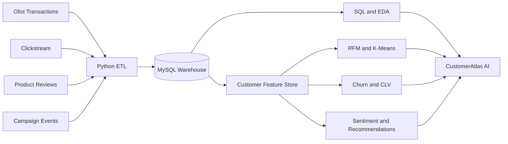
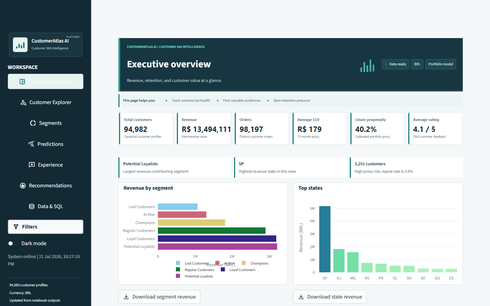
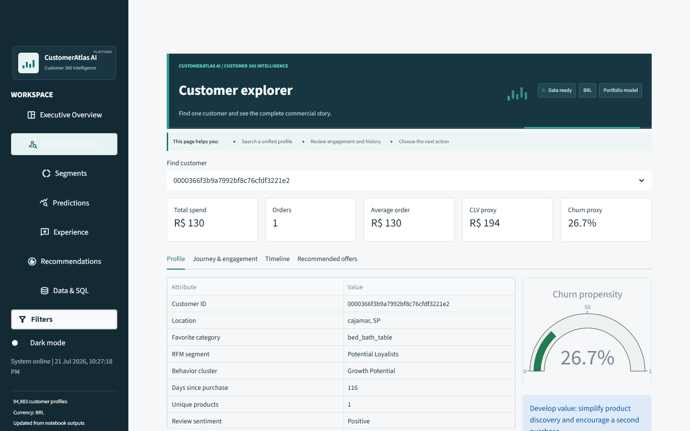

# Customer 360 Intelligence Platform

> An end-to-end customer analytics platform for unified profiles, segmentation, churn propensity, customer value, sentiment, and recommendations.

[](https://customer-360-intelligence-platform-nyuvsgcvgegztjguffmarm.streamlit.app/)

[](https://www.python.org/)
[](https://www.mysql.com/)
[](https://streamlit.io/)
[](https://xgboost.ai/)

## Overview

CustomerAtlas AI combines transaction, clickstream, campaign, and review data into a governed Customer 360 layer. The project covers the complete analytics lifecycle: source auditing, Python ETL, dimensional modeling in MySQL, SQL analysis, feature engineering, machine learning, release validation, and an interactive Streamlit application.

The platform helps business teams identify valuable customers, prioritize retention audiences, understand customer experience, and select relevant cross-sell opportunities. Synthetic mappings and proxy targets are labeled clearly so portfolio demonstrations are not presented as observed production outcomes.

## Business Problem

Customer information is commonly distributed across sales, website, marketing, and feedback systems. This fragmentation makes it difficult to answer:

- Who are the highest-value and most loyal customers?
- Which audiences show signs associated with inactivity?
- Which regions and categories generate the most revenue?
- How does customer experience affect review scores?
- Which category should be recommended next?

## Solution Architecture


```mermaid
flowchart LR
    A[Olist Transactions] --> E[Python ETL]
    B[Clickstream] --> E
    C[Product Reviews] --> E
    D[Campaign Events] --> E
    E --> F[(MySQL Warehouse)]
    F --> G[SQL and EDA]
    F --> H[Customer Feature Store]
    H --> I[RFM and K-Means]
    H --> J[Churn and CLV]
    H --> K[Sentiment and Recommendations]
    G --> L[CustomerAtlas AI]
    I --> L
    J --> L
    K --> L
```

The warehouse uses dimensions for customers, products, dates, and campaigns, with separate facts for orders, payments, web activity, reviews, and campaign response. See [`sql/schema.sql`](sql/schema.sql) and [`sql/business_queries.sql`](sql/business_queries.sql).

## Key Features

| Feature | Business value |
|---|---|
| Customer 360 Profile | Search one customer and review spend, orders, engagement, ratings, segments, risk, value, history, and recommended action |
| RFM Segmentation | Identify Champions, Loyal Customers, Potential Loyalists, At Risk, Lost, and Regular audiences |
| Behavioral Clustering | Discover High Value, Inactive, Digitally Engaged, Growth Potential, and Regular Buyer groups |
| Churn Propensity | Compare models and provide a risk score, risk band, feature drivers, and retention action |
| CLV Proxy | Estimate forward customer value, value tier, planning range, and commercial action |
| Sentiment Intelligence | Explore review sentiment, trends, complaints, praise, categories, and review text |
| Recommendation Engine | Generate explainable next-best-category suggestions using basket co-occurrence |
| SQL Analytics | Analyze revenue, repeat purchasing, campaign ROI, payment behavior, ratings, and loyalty |

## Verified Results

- Created **94,983** app-ready canonical customer profiles.
- Modeled **112,650** order-item records and a **300,000-event** clickstream sample.
- Generated **474,915** explainable category recommendations.
- Built and validated six sequential notebooks with explicit data contracts.
- Deployed seven interactive Streamlit destinations with filters, search, prediction forms, and exports.

### Model Evaluation

| Task | Selected model | Held-out result |
|---|---|---|
| Churn propensity proxy | XGBoost | Accuracy `0.642`, ROC-AUC `0.666` |
| 12-month CLV proxy | XGBoost | MAE `BRL 38.15`, R^2 `0.918` |
| Review sentiment | TF-IDF + Logistic Regression | Accuracy `0.855`, weighted F1 `0.883` |

Churn and CLV metrics measure recovery of calibrated proxy targets, not realized churn reduction or revenue lift.

## Business Insights

| Finding | Recommended action |
|---|---|
| The highest-spending 20% of customers generated **56.7% of merchandise revenue**. | Protect high-value audiences with loyalty and relevant cross-sell offers. |
| Only **3.0%** of canonical customers placed more than one order. | Build a measurable second-purchase journey. |
| Sao Paulo generated approximately **BRL 5.16M** in merchandise revenue. | Prioritize inventory and delivery capacity in high-value states. |
| Late deliveries averaged **2.57 stars**, compared with **4.25 stars** for on-time deliveries. | Trigger proactive delay communication and investigate logistics issues. |

## Dashboard Preview

### Executive Overview



### Customer Explorer



**[Open the live Customer 360 dashboard](https://customer-360-intelligence-platform-nyuvsgcvgegztjguffmarm.streamlit.app/)**

## Technology Stack

| Area | Technologies |
|---|---|
| Data and EDA | Python, Pandas, NumPy, Jupyter, Matplotlib, Seaborn |
| Database | MySQL 8.0, SQL, SQLAlchemy, PyMySQL |
| Machine learning | Scikit-learn, XGBoost, Random Forest, K-Means, Logistic/Linear Regression |
| NLP and recommendations | TF-IDF, basket co-occurrence, popularity fallback |
| Visualization and application | Plotly, Streamlit, WordCloud, ReportLab |

## Data Sources

| Source | Role |
|---|---|
| Olist Brazilian E-Commerce | Canonical customer, order, payment, product, and rating data |
| E-Commerce Events History | Behavioral engagement through a simulated identity map |
| Datafiniti Amazon Reviews | Independent product-level sentiment intelligence |
| Generated campaign events | Clearly labeled marketing funnel demonstration |

All monetary values use Brazilian reais (`BRL`, displayed as `R$`). Raw data requirements are documented in [`data/raw/README.md`](data/raw/README.md).

## Repository Structure

```text
Customer 360 Intelligence/
|-- data/
|   |-- raw/                  # Local source files and manifest
|   `-- processed/            # Warehouse and app artifacts
|-- docs/images/              # Dashboard screenshots
|-- models/                   # Saved ML pipelines
|-- notebooks/                # 01 audit through 06 release validation
|-- sql/
|   |-- schema.sql
|   `-- business_queries.sql
|-- streamlit_app/app.py
|-- requirements.txt
`-- README.md
```

## Run Locally

```powershell
git clone https://github.com/suhani-chauhan56/Customer-360-Intelligence-Platform.git
cd Customer-360-Intelligence-Platform
python -m venv .venv
.venv\Scripts\Activate.ps1
pip install -r requirements.txt
jupyter notebook
```

Place the required CSV files in `data/raw/`, then run notebooks `01` through `06` using **Restart Kernel and Run All Cells**. Notebook 06 must report `Release checks passed.`

Launch the application:

```powershell
streamlit run streamlit_app/app.py
```

MySQL loading is optional. Execute `sql/schema.sql`, set `LOAD_TO_MYSQL=true` and the `MYSQL_*` environment variables, then rerun Notebook 02.

## Limitations

- Churn and CLV are calibrated portfolio proxies because observed labels are unavailable.
- Clickstream identities and campaign events are simulated and explicitly marked.
- External reviews are never joined to Olist customers.
- The project demonstrates an enterprise analytics workflow but is not presented as a production customer-data platform.

## Author

**Suhani Chauhan**  
Data Analyst | Customer Analytics | SQL | Python | Machine Learning

[GitHub](https://github.com/suhani-chauhan56) | [LinkedIn](https://www.linkedin.com/in/suhani-chauhan-39055832a) | [Live Application](https://customer-360-intelligence-platform-nyuvsgcvgegztjguffmarm.streamlit.app/)
