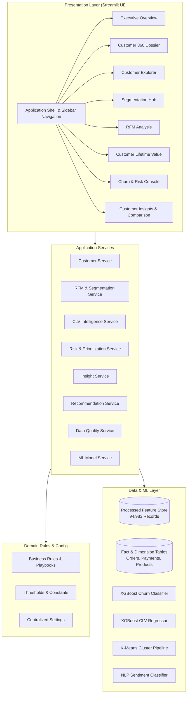

# CustomerAtlas — Unified Customer Intelligence Platform

[](https://customer-360-intelligence-platform-nyuvsgcvgegztjguffmarm.streamlit.app/)
[](https://www.python.org/)
[](https://xgboost.ai/)
[](https://github.com/astral-sh/ruff)
[](https://docs.pytest.org/)

> **CustomerAtlas** is a production-engineered Customer Intelligence SaaS platform that unifies omnichannel transactions, clickstream events, marketing campaigns, and customer feedback into a single actionable decision layer.

---

## 1. Product Overview

CustomerAtlas transforms raw multi-source e-commerce and marketing data into an enterprise-grade customer intelligence system. Designed for **Customer Success, Growth, Retention, Revenue Operations, and Analytics teams**, the platform enables organizations to:

1. **Understand Portfolio Health:** Monitor macro merchandise gross volume (GMV), active customer counts, repeat purchase velocity, and regional demand concentration.
2. **Explore Canonical Profiles:** Discover, search, and filter 94,983 canonical customer records with decision-useful attributes and multi-criteria filters.
3. **Inspect Customer 360 Dossiers:** Open unified profiles with 6-dimension vital health signs, verifiable lifecycle milestone progressions, order histories, payment breakdowns, and explainable next-best-category offers.
4. **Segment Customer Bases:** Analyze 6 canonical RFM audience cohorts, drill down into segment economics, and compare segments side-by-side.
5. **Model Forward Lifetime Value:** Estimate forward 12-month CLV with dynamic value bands, high-value cohort analysis, and live XGBoost scenario simulations.
6. **Diagnose & Prioritize Churn Risk:** Quantify total revenue at risk, explore a 4-quadrant value-risk prioritization matrix, and rank an actionable retention queue.
7. **Empirical Data Storytelling:** Access structured, evidence-backed business insights detailing revenue concentration, single-purchase drop-offs, and geographic demand hubs.

---

## 2. System Architecture

CustomerAtlas adheres to clean enterprise software architecture principles, separating presentation from application services, domain business rules, data loading, and machine learning inference.


```mermaid
flowchart TD
    subgraph PresentationLayer["Presentation Layer (Streamlit UI)"]
        A[Application Shell & Sidebar Navigation] --> B[Executive Overview]
        A --> C[Customer 360 Dossier]
        A --> D[Customer Explorer]
        A --> E[Segmentation Hub]
        A --> F[RFM Analysis]
        A --> G[Customer Lifetime Value]
        A --> H[Churn & Risk Console]
        A --> I[Customer Insights & Comparison]
    end

    subgraph ApplicationLayer["Application Services"]
        S1[Customer Service]
        S2[RFM & Segmentation Service]
        S3[CLV Intelligence Service]
        S4[Risk & Prioritization Service]
        S5[Insight Service]
        S6[Recommendation Service]
        S7[Data Quality Service]
        S8[ML Model Service]
    end

    subgraph DomainLayer["Domain Rules & Config"]
        R1[Business Rules & Playbooks]
        R2[Thresholds & Constants]
        R3[Centralized Settings]
    end

    subgraph DataMLLayer["Data & ML Layer"]
        D1[(Processed Feature Store\n94,983 Records)]
        D2[(Fact & Dimension Tables\nOrders, Payments, Products)]
        M1[XGBoost Churn Classifier]
        M2[XGBoost CLV Regressor]
        M3[K-Means Cluster Pipeline]
        M4[NLP Sentiment Classifier]
    end

    PresentationLayer --> ApplicationLayer
    ApplicationLayer --> DomainLayer
    ApplicationLayer --> DataMLLayer
```

---

## 3. Key Intelligence Workspaces

| Workspace | Domain | Core Business Value |
|---|---|---|
| **Executive Overview** | Overview | Macro revenue velocity, repeat customer rate ($3.0\%$), regional demand hubs, and at-risk revenue exposure. |
| **Customer 360** | Customer Intelligence | Complete customer dossier, 6-dimension vital health matrix, lifecycle milestones, order timelines, payment methods, and PDF dossier export. |
| **Customer Explorer** | Customer Intelligence | Paginated ($10, 25, 50, 100$), sortable customer table with multi-filter search and 1-click drill-down to Customer 360. |
| **Segmentation** | Customer Intelligence | RFM segment breakdown, segment drill-down, side-by-side segment comparison, and custom marketing cohort builder. |
| **RFM Analysis** | Customer Value | Portfolio distributions of Recency, Frequency, and Monetary spend with multi-dimensional scatter matrices. |
| **Customer Lifetime Value** | Customer Value | 12-month forward CLV benchmarks, dynamic value bands ($<\text{R}\$100$ to $>\text{R}\$1,000$), top 10% high-value cohort analysis, and live CLV simulation. |
| **Churn & Risk** | Customer Risk | Revenue at risk quantification, 4-quadrant value-risk matrix, XGBoost feature drivers, and retention prioritization queue. |
| **Customer Insights** | Insights | Structured evidence-backed business insights and objective customer-to-customer comparison tool. |

---

## 4. Machine Learning Governance & Model Registry

All predictive capabilities use validated, serialized machine learning artifacts with published metadata and evaluation benchmarks:

| Model Task | Algorithm | Held-Out Benchmark | Artifact File | Version |
|---|---|---|---|---|
| **Churn Propensity Proxy** | XGBoost Classifier | $\text{ROC-AUC } 0.666 \;\vert\; \text{Acc } 0.642$ | `models/churn_model.pkl` | `1.0.0` |
| **12-Month Forward CLV** | XGBoost Regressor | $R^2 = 0.918 \;\vert\; \text{MAE } \text{BRL } 38.15$ | `models/clv_model.pkl` | `1.0.0` |
| **Customer Clustering** | K-Means + StandardScaler | 5 Behavioral Clusters | `models/segment_model.pkl` | `1.0.0` |
| **Review Sentiment** | TF-IDF + Logistic Regression | $\text{Weighted F1 } 0.883 \;\vert\; \text{Acc } 0.855$ | `models/sentiment_model.pkl` | `1.0.0` |

> **Governance Notice:** Olist transaction logs represent marketplace orders without contractual subscription cancellations. Churn probabilities reflect calibrated purchase inactivity propensities for retention prioritization and are labeled transparently across all workspaces.

---

## 5. Repository Structure

```text
Customer-360-Intelligence/
├── .github/
│   └── workflows/
│       └── ci.yml                     # Automated CI testing and linting workflow
├── .streamlit/
│   └── config.toml                    # Production Streamlit server and theme configuration
├── data/
│   ├── processed/                     # Validated dimensional warehouse facts and feature store
│   └── raw/                           # Source Olist, Clickstream, and Review datasets
├── docs/
│   └── deployment-checklist.md        # Production verification deployment gates
├── models/
│   ├── metadata/                      # Provenance and benchmark metadata JSON files
│   ├── churn_model.pkl                # Serialized Churn XGBoost model
│   ├── clv_model.pkl                  # Serialized 12M CLV XGBoost model
│   ├── segment_model.pkl              # Serialized K-Means pipeline
│   └── sentiment_model.pkl            # Serialized Sentiment model
├── sql/
│   ├── schema.sql                     # Dimensional star schema definition
│   └── business_queries.sql           # Predefined analytical business queries
├── streamlit_app/
│   ├── app.py                         # Application entry point and workspace coordinator
│   ├── assets/
│   │   └── style.css                  # Centralized B2B SaaS design system stylesheet
│   ├── components/                    # Reusable UI presentation components
│   │   ├── cards.py                   # Hero, empty, and recommendation cards
│   │   ├── customer_profile.py        # 360 header, health grid, lifecycle journey, risk diagnostics
│   │   ├── customer_table.py          # Paginated analytical customer explorer table
│   │   ├── data_quality_card.py       # System health & data contract console
│   │   ├── footer.py                  # Standard application footer
│   │   ├── header.py                  # Global status header and breadcrumb bars
│   │   ├── insight_card.py            # Structured insight component (Obs/Evidence/Implication)
│   │   ├── methodology.py             # Reusable governance and formula panels
│   │   ├── metric_cards.py            # Standardized KPI cards and row renderers
│   │   └── sidebar.py                 # Product IA navigation and global filters
│   ├── config/                        # Configuration, settings, and thresholds
│   │   ├── settings.py                # Environment-driven settings and directory paths
│   │   ├── thresholds.py              # Analytical boundaries and constants
│   │   └── business_rules.py          # Commercial retention playbooks and segment rules
│   ├── services/                      # Application and domain business logic
│   │   ├── clv_service.py             # CLV benchmarks, binning, and high-value analysis
│   │   ├── customer_service.py        # Customer search, health vitals, lifecycle progression
│   │   ├── data_quality_service.py    # Automated schema checks and integrity audits
│   │   ├── data_service.py            # Cached data loaders and PDF dossier generation
│   │   ├── insight_service.py         # Empirical structured insight generators
│   │   ├── model_service.py           # Safe model loading, input schema, and inference
│   │   ├── recommendation_service.py  # Explainable next-best-category offers
│   │   ├── rfm_service.py             # RFM distributions and segment comparison
│   │   └── risk_service.py            # At-risk revenue, 4-quadrant matrix, priority scoring
│   └── utils/                         # Utilities, formatting, and exceptions
│       ├── exceptions.py              # Custom domain and infrastructure exceptions
│       ├── formatting.py              # Currency (BRL), percentage, number formatters
│       ├── helpers.py                 # Defensive type casting and snapshot metrics
│       ├── logging_config.py          # Structured application logger
│       ├── styling.py                 # Plotly chart theming and color palettes
│       └── validation.py              # Schema contract validation and ID verification
├── tests/                             # Automated test suite
│   ├── conftest.py                    # Pytest configuration and shared fixtures
│   ├── unit/                          # Unit tests for formatting, validation, config, helpers
│   ├── services/                      # Service tests for customer, RFM, CLV, risk, model, data quality
│   ├── data/                          # Real data artifact integrity checks
│   └── integration/                   # End-to-end intelligence workflow tests
├── requirements.txt                   # Production dependencies
├── requirements-dev.txt               # Development and testing dependencies
├── .gitignore                         # Production gitignore
├── LICENSE                            # MIT License
└── README.md                          # Platform documentation
```

---

## 6. Local Development & Setup

### Prerequisites
- Python 3.11 or higher
- Git

### Installation Steps

1. **Clone the Repository:**
   ```bash
   git clone https://github.com/suhani-chauhan56/Customer-360-Intelligence-Platform.git
   cd Customer-360-Intelligence-Platform
   ```

2. **Create and Activate Virtual Environment:**
   ```bash
   # Windows (PowerShell)
   python -m venv .venv
   .venv\Scripts\Activate.ps1

   # Linux / macOS
   python3 -m venv .venv
   source .venv/bin/activate
   ```

3. **Install Dependencies:**
   ```bash
   pip install --upgrade pip
   pip install -r requirements-dev.txt
   ```

4. **Launch the Streamlit Application:**
   ```bash
   streamlit run streamlit_app/app.py
   ```
   Open your browser at `http://localhost:8501`.

---

## 7. Environment Variables

The application can be configured using standard environment variables:

| Variable | Default Value | Description |
|---|---|---|
| `APP_ENV` | `production` | Runtime environment (`development`, `testing`, `production`). |
| `LOG_LEVEL` | `INFO` | Logging verbosity (`DEBUG`, `INFO`, `WARNING`, `ERROR`). |
| `DATA_DIR` | `<root>/data/processed` | Path to directory containing processed CSV feature stores. |
| `MODELS_DIR` | `<root>/models` | Path to directory containing serialized `.pkl` models. |
| `CACHE_TTL_SECONDS` | `3600` | Streamlit caching time-to-live duration in seconds. |

---

## 8. Running Automated Tests

CustomerAtlas includes a comprehensive test suite covering unit formatting, schema validation, domain services, model inference contracts, data integrity, and end-to-end flows:

```bash
# Run all tests with verbose output
pytest tests/ -v

# Run tests with test coverage reporting
pytest tests/ --cov=streamlit_app --cov-report=term-missing

# Run code linting check
ruff check streamlit_app tests
```

---

## 9. Data Quality & Contract Audits

The system performs 6 automated integrity checks on startup and exposes them in the **System Health Console**:

1. **Required Schema Columns:** Verifies presence of all core identifier, financial, RFM, and ML feature columns.
2. **Customer ID Uniqueness:** Confirms zero duplicate customer ID records.
3. **Customer ID Completeness:** Confirms zero missing/null customer IDs.
4. **Non-Negative Revenue:** Confirms all transaction and spend figures $\ge 0$.
5. **Calibrated Churn Range:** Confirms all churn probabilities reside strictly within $[0.0, 1.0]$.
6. **Order Count Sanity:** Confirms all order counts are positive integers $\ge 1$.

---

## 10. Deployment Engineering

CustomerAtlas is optimized for deployment to **Streamlit Community Cloud**, Docker containers, or Kubernetes clusters.

### Pre-Deployment Verification
Follow the operational checklist in [`docs/deployment-checklist.md`](docs/deployment-checklist.md) before publishing release tags.

---

## 11. Limitations & Analytical Assumptions

1. **Dataset Timeline:** Source transactions span 2016 to 2018. Recency days are calculated relative to the latest transaction timestamp in the warehouse.
2. **Subscription Proxy:** E-commerce order histories lack contractual churn events; churn probabilities reflect calibrated inactivity propensities.
3. **Monetary Units:** All currency values are expressed in Brazilian Reais ($\text{BRL}, \text{R}\$$).
4. **Attribution Modeling:** Marketing campaign touchpoints demonstrate synthetic attribution simulation to illustrate multi-channel ROI calculations.

---

## 12. License & Attribution

Developed by **Suhani Chauhan** as an enterprise-grade Customer Intelligence SaaS platform. Released under the [MIT License](LICENSE).
