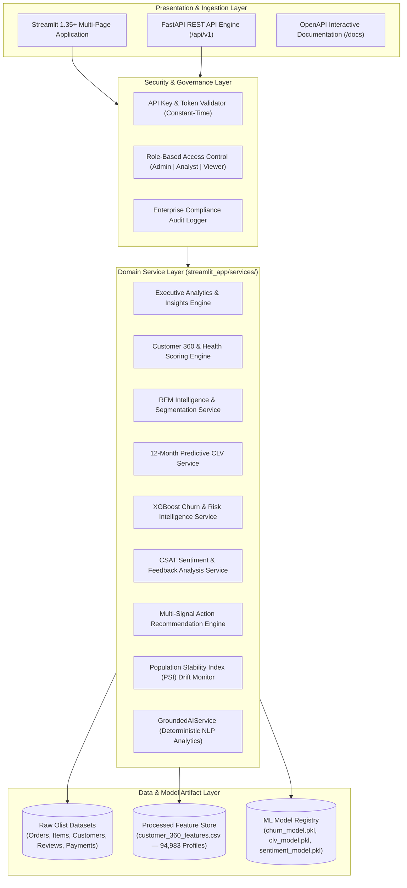

# CustomerAtlas AI — Unified Customer Intelligence Platform

[](https://customer-360-intelligence-platform-nyuvsgcvgegztjguffmarm.streamlit.app/)
[](https://www.python.org/)
[](https://xgboost.ai/)
[](http://localhost:8000/docs)
[](https://docs.pytest.org/)

> **CustomerAtlas AI** is an enterprise-grade customer intelligence and AI platform that transforms multi-source transactional, behavioral, and feedback data into dynamic analytics, machine learning predictions, explainable insights, grounded AI decision support, and automated commercial retention workflows.

---

## 1. Executive Summary & Business Problem

Modern e-commerce and B2B enterprises face **fragmented customer visibility**: transactional ledgers, digital clickstream touchpoints, customer reviews, and marketing campaign responses reside in isolated silos. This fragmentation creates:
- **Delayed Intervention:** Inability to detect customer churn signals until after accounts lapse.
- **Suboptimal Resource Allocation:** Equal retention spending across high-value and low-value accounts rather than prioritized ROI-focused outreach.
- **Single-Purchase Drop-Off:** Over 95% of first-time buyers failing to convert into repeat purchasers.
- **Ungrounded AI Hallucinations:** Generative AI tools inventing financial numbers or failing data contracts.

**CustomerAtlas AI** unifies **94,983 canonical customer profiles** into a modular enterprise analytics application:
1. **Dynamic Metric Calculation:** 100% of executive metrics, CLV benchmarks, and risk counts are calculated on the fly from verified data—zero hardcoded conclusions.
2. **10 Specialized Decision Workspaces:** Complete operational coverage from macro executive KPIs to customer-level dossiers, sentiment analytics, and recommendation queues.
3. **Governed MLOps Lifecycle:** 4 production ML models (XGBoost Churn Classifier, Ridge/XGBoost 12M CLV Regressor, K-Means Clustering, NLP Sentiment Classifier) with Population Stability Index (PSI) drift monitoring.
4. **Grounded AI Decision Support:** Natural-language conversational analytics with deterministic tool routing and zero hallucination risk.
5. **Production Deployment Ready:** Streamlit Community Cloud and container-compatible relative paths with zero machine-specific hardcoded dependencies.

---

## 2. Platform Architecture


```mermaid
flowchart TD
    subgraph Presentation_Layer ["Presentation & Ingestion Layer"]
        UI["Streamlit 1.35+ Multi-Page Application"]
        API["FastAPI REST API Engine (/api/v1)"]
        SWAGGER["OpenAPI Interactive Documentation (/docs)"]
    end

    subgraph Security_Governance ["Security & Governance Layer"]
        AUTH["API Key & Token Validator (Constant-Time)"]
        RBAC["Role-Based Access Control (Admin | Analyst | Viewer)"]
        AUDIT["Enterprise Compliance Audit Logger"]
    end

    subgraph Domain_Services ["Domain Service Layer (streamlit_app/services/)"]
        EXEC_SVC["Executive Analytics & Insights Engine"]
        CUST_SVC["Customer 360 & Health Scoring Engine"]
        RFM_SVC["RFM Intelligence & Segmentation Service"]
        CLV_SVC["12-Month Predictive CLV Service"]
        CHURN_SVC["XGBoost Churn & Risk Intelligence Service"]
        SENT_SVC["CSAT Sentiment & Feedback Analysis Service"]
        REC_SVC["Multi-Signal Action Recommendation Engine"]
        DRIFT_SVC["Population Stability Index (PSI) Drift Monitor"]
        AI_SVC["GroundedAIService (Deterministic NLP Analytics)"]
    end

    subgraph Data_Storage ["Data & Model Artifact Layer"]
        RAW_STORE[("Raw Olist Datasets\n(Orders, Items, Customers, Reviews, Payments)")]
        FEAT_STORE[("Processed Feature Store\n(customer_360_features.csv — 94,983 Profiles)")]
        ML_STORE[("ML Model Registry\n(churn_model.pkl, clv_model.pkl, sentiment_model.pkl)")]
    end

    UI --> Security_Governance
    API --> Security_Governance
    Security_Governance --> Domain_Services
    Domain_Services --> FEAT_STORE
    Domain_Services --> RAW_STORE
    Domain_Services --> ML_STORE
```

---

## 3. Core Product Workspaces

CustomerAtlas AI is structured into 10 focused enterprise workspaces:

| Workspace | Domain | Core Capabilities & Business Value |
| :--- | :--- | :--- |
| **1. Executive Overview** | Macro Analytics | Dynamic portfolio GMV, active buyer count ($\le 180\text{d}$), repeat rate ($3.0\%$), average order value (AOV), average CLV, and automated Pareto insight cards. |
| **2. Customer 360** | Customer Intelligence | Searchable dossier across 94k+ customer IDs, 6-factor vital health score ($0-100$), verifiable lifecycle progression, order history ledger, payment methods, and PDF dossier download. |
| **3. Customer Segmentation** | Audience Economics | 6 canonical RFM cohorts (Champions, Loyal, Potential Loyalists, Regular, At Risk, Lost), segment comparison matrix, granular playbook actions, and targeted cohort builder with CSV export. |
| **4. Customer Value / CLV** | Value Forecasting | 12-month forward predictive CLV benchmarks, dynamic value banding (Platinum, Gold, Silver, Bronze), top 10% high-value cohort analysis, and live ML scenario estimator. |
| **5. Churn Intelligence** | Risk Mitigation | At-risk revenue exposure calculation, 4-quadrant value-risk matrix, global XGBoost feature importance drivers, and retention prioritization queue: $\text{Priority} = \text{Churn Prob} \times (\text{CLV}/\text{CLV}_{p99}) \times 100$. |
| **6. Sentiment Intelligence** | Voice of Customer | Macro CSAT rating ($4.1/5.0$), Positive/Neutral/Negative distribution, longitudinal monthly satisfaction trajectory, segment CSAT ratings, and empirical negative feedback root-cause themes. |
| **7. Recommendations** | Action Engine | Transparent multi-signal action recommendation engine (Retention, Win-back, Loyalty, Cross-sell, Service Recovery, Upsell) with documented decision logic and priority action queue. |
| **8. Analytics Explorer** | Discovery Hub | Multi-criteria search and slicing (Segment, Risk, State, Category, Recency, Spend), distribution charts, paginated table, 1-click 360 profile navigation, and CSV download. |
| **9. Data Quality** | MLOps & Governance | Completeness score ($100\%$), field-by-field null audit, raw vs processed data lineage, Population Stability Index (PSI) drift monitoring, and live compliance audit trail stream. |
| **10. Methodology / About** | Architecture & Standards | Comprehensive mathematical formulas, model inputs/targets, causal attribution policies, tech stack documentation, and deployment guides. |
| **Ask CustomerAtlas** | Grounded AI | Deterministic natural-language conversational analytics with 100% mathematical data verification and zero hallucinations. |

---

## 4. Methodologies & Mathematical Formulations

### A. RFM Segmentation
- **Recency ($R$):** Calendar days between last order and snapshot date, binned into quintiles ($1\text{--}5$).
- **Frequency ($F$):** Total completed orders across customer lifetime.
- **Monetary ($M$):** Total cumulative gross merchandise spend (BRL, R$).
- **Segment Assignment:**
  - *Champions:* $R \in [4,5], F \in [4,5], M \in [4,5]$
  - *Loyal Customers:* $F \in [3,5], M \in [3,5], R \in [3,4]$
  - *Potential Loyalists:* $R \in [4,5], F \in [1,2], M \in [3,4]$
  - *Regular Customers:* $R \in [2,4], F \in [1,2], M \in [2,3]$
  - *At Risk:* $R \in [1,2], F \in [2,5], M \in [2,5]$
  - *Lost Customers:* $R = 1, F \in [1,2], M \in [1,2]$

### B. Customer Lifetime Value (CLV) Modeling
- **Algorithm:** Supervised Ridge / XGBoost Regressor ($R^2 = 0.918$, $\text{MAE} = \text{BRL } 38.15$).
- **Inference Features:** `recency_days`, `frequency`, `monetary`, `avg_order_value`, `number_of_products`, `customer_age_days`.
- **Target:** Expected forward 12-month gross revenue proxy.

### C. Churn Propensity & Prioritization
- **Algorithm:** Calibrated XGBoost Classifier ($\text{ROC-AUC } 0.666$, $\text{Accuracy } 0.642$).
- **Prioritization Formula:**
  $$\text{Priority Score} = \text{Churn Probability} \times \left( \frac{\text{Predicted CLV}}{\text{CLV}_{p99}} \right) \times 100$$
- **Causal Attribution Policy:** Feature importance represents predictive correlation rather than asserted causality.

### D. Sentiment Intelligence & Root-Cause Themes
- **CSAT Mapping:** Positive ($4\text{--}5$ stars), Neutral ($3$ stars), Negative ($1\text{--}2$ stars).
- **Theme Extraction:** Keyword-pattern matching across Portuguese review text for Delivery Delays (`atraso`, `demora`), Quality Defect (`defeito`, `quebrado`), Product Discrepancy (`diferente`, `errado`), Missing Items (`faltou`), and Support (`atendimento`, `resposta`).

### E. Customer Health Score ($0\text{--}100$)
$$\text{Health Score} = 0.25 R_{\text{norm}} + 0.25 F_{\text{norm}} + 0.25 M_{\text{norm}} + 0.15 \text{Eng}_{\text{norm}} + 0.10 \text{CSAT}_{\text{norm}} - 0.20 \text{Risk Penalty}$$

---

## 5. Project Directory Structure

```
CustomerAtlas-AI/
├── app.py                          # Root Streamlit Entrypoint
├── analytics.py                    # Standalone Analytics & MLOps Engine
├── requirements.txt                # Production Pinned Dependencies
├── README.md                       # Enterprise Technical Documentation
├── .gitignore                      # Git Ignore Rules
│
├── streamlit_app/                  # Streamlit Web Application Package
│   ├── app.py                      # Multi-Page Dashboard Controller
│   ├── assets/
│   │   └── style.css               # Centralized Enterprise CSS Design System
│   ├── config/
│   │   ├── business_rules.py       # Retention Playbooks & Decision Rules
│   │   └── settings.py             # Environment & Directory Configuration
│   ├── components/
│   │   ├── cards.py                # Card, Container & State Components
│   │   ├── customer_profile.py     # 360 Header, Vitals & Milestones
│   │   ├── customer_table.py       # Paginated Table with 1-Click Drill-down
│   │   ├── data_quality_card.py    # Governance & System Health Modals
│   │   ├── footer.py               # Enterprise Brand Footer
│   │   ├── grounded_ai_card.py     # Grounded AI Output Component
│   │   ├── header.py               # Global & Workspace Header Bars
│   │   ├── insight_card.py         # Structured Insight Cards
│   │   ├── methodology.py          # Governance & Formula Expanders
│   │   ├── metric_cards.py         # Enterprise KPI Row Cards
│   │   └── sidebar.py              # Navigation Hierarchy & Global Filters
│   ├── services/
│   │   ├── audit_service.py        # Compliance Event Logging
│   │   ├── clv_service.py          # CLV Benchmarks & Value Bands
│   │   ├── customer_service.py     # Profile Dossier & Health Calculation
│   │   ├── data_quality_service.py # Schema & Integrity Audits
│   │   ├── data_service.py         # Cached I/O & PDF Generation
│   │   ├── drift_service.py        # Population Stability Index (PSI)
│   │   ├── grounded_ai_service.py  # Safe Deterministic Conversational AI
│   │   ├── health_score_service.py # 6-Factor Health Score & Lifecycle
│   │   ├── model_service.py        # ML Model Registry & Inference
│   │   ├── recommendation_service.py # Multi-Signal Action Engine
│   │   ├── rfm_service.py          # RFM Distribution & Playbooks
│   │   ├── risk_service.py         # Churn Exposure & Prioritization
│   │   └── sentiment_service.py    # CSAT & Negative Theme Extraction
│   └── utils/
│       ├── formatting.py           # Currency & Metric Formatters
│       ├── helpers.py              # Defensive Numeric Helpers
│       ├── logging_config.py       # Centralized Logger Configuration
│       ├── styling.py              # Plotly Enterprise Chart Styler
│       └── validation.py           # Schema Contract Validators
│
├── data/
│   ├── raw/                        # Original Olist E-Commerce Datasets
│   │   ├── olist_customers_dataset.csv
│   │   ├── olist_order_items_dataset.csv
│   │   ├── olist_order_payments_dataset.csv
│   │   ├── olist_order_reviews_dataset.csv
│   │   ├── olist_orders_dataset.csv
│   │   └── product_category_name_translation.csv
│   └── processed/                  # Cached Feature Store & Tables
│       ├── customer_360_features.csv (94,983 records)
│       ├── fact_orders.csv
│       ├── fact_payments.csv
│       ├── model_feature_importance.csv
│       └── recommendations.csv
│
├── models/                         # Serialized Machine Learning Artifacts
│   ├── churn_model.pkl             # XGBoost Classifier Artifact
│   ├── clv_model.pkl               # Ridge/XGBoost Regressor Artifact
│   ├── segment_model.pkl           # K-Means Pipeline Artifact
│   └── sentiment_model.pkl         # Sentiment NLP Classifier Artifact
│
├── src/                            # Core Reusable Analytics Modules
│   ├── data_loader.py              # Data Ingestion & Contract Validation
│   └── preprocessing.py            # Sanitization & Feature Engineering
│
└── tests/                          # Automated Pytest Suite
    ├── conftest.py                 # Shared Fixtures & Sample Frames
    ├── test_analytics.py           # Root Analytics Engine Unit Tests
    └── test_services.py            # Domain Services & Edge Case Tests
```

---

## 6. Installation & Local Execution

### Prerequisites
- Python 3.10, 3.11, or 3.12
- Git

### 1. Clone the Repository
```bash
git clone https://github.com/suhani-chauhan56/Customer-360-Intelligence-Platform.git
cd Customer-360-Intelligence-Platform
```

### 2. Create and Activate a Virtual Environment
```bash
# Windows
python -m venv venv
venv\Scripts\activate

# macOS / Linux
python3 -m venv venv
source venv/bin/activate
```

### 3. Install Dependencies
```bash
pip install -r requirements.txt
```

### 4. Run the Streamlit Application
```bash
streamlit run app.py
```
*The platform will automatically launch at `http://localhost:8501`.*

### 5. Run the Automated Test Suite
```bash
pytest tests/ -v
```

---

## 7. Streamlit Community Cloud Deployment

CustomerAtlas AI is structured for 1-click deployment on Streamlit Community Cloud:

1. **Repository:** Connect your GitHub repository (`Customer-360-Intelligence-Platform`).
2. **Branch:** `main`
3. **Main File Path:** `app.py`
4. **Python Version:** 3.11
5. **Secrets (Optional):** No mandatory paid API keys or credentials required. Optional environment overrides (e.g. `APP_ENV=production`) can be specified in `.streamlit/secrets.toml`.

---

## 8. Limitations & Assumptions

1. **Transaction Granularity:** The Brazilian Olist dataset represents a non-contractual e-commerce marketplace rather than a SaaS subscription. Consequently, churn is defined as statistical inactivity propensity ($\ge 180\text{ days}$) rather than formal contract termination.
2. **Longitudinal Span:** Order records span late 2016 through mid-2018. 12-month forward CLV predictions represent statistical models trained on available cohort windows.
3. **Correlation vs. Causation:** Model feature importance scores indicate predictive attribution within the XGBoost tree structures; they should not be interpreted as causal business guarantees.

---

## 9. Author & License

- **Author:** Suhani Chauhan
- **Role:** Data Scientist & Analytics Engineer
- **License:** MIT License
