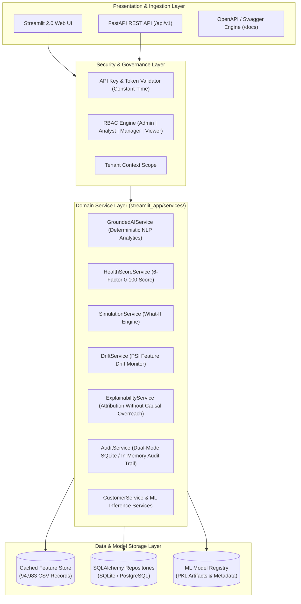

# CustomerAtlas — Unified Customer Intelligence & AI Platform

[](http://localhost:8000/docs)
[](https://customer-360-intelligence-platform-nyuvsgcvgegztjguffmarm.streamlit.app/)
[](https://www.python.org/)
[](https://xgboost.ai/)
[](https://www.sqlalchemy.org/)
[](https://docs.pytest.org/)

> **CustomerAtlas** is an end-to-end customer intelligence platform that transforms multi-source customer data into analytics, machine learning predictions, explainable insights, grounded AI decision support, and operational retention workflows.

---

## 1. Executive Summary & Problem-Solution Fit

Modern e-commerce and B2B SaaS organizations suffer from **fragmented customer visibility**: transactional data, clickstream touchpoints, marketing conversions, and customer reviews reside in siloed databases. Decision-makers often face delayed reporting, ungrounded AI hallucinations, and lack of actionable retention mechanisms.

**CustomerAtlas** solves this by unifying **94,983 canonical customer profiles** into an **Enterprise Modular Monolith**:
1. **Dual Ingestion & Delivery:** Streamlit UI for visual analytics + FastAPI REST API (`/api/v1`) with OpenAPI docs for headless enterprise integration.
2. **Grounded AI Decision Support ("Ask CustomerAtlas"):** Safe natural-language analytics backed by deterministic verification tools—eliminating SQL injection and hallucinated numbers.
3. **Database Readiness:** SQLAlchemy ORM models and clean Repository Pattern supporting SQLite (dev) and PostgreSQL (production).
4. **Governed MLOps Lifecycle:** 4 production-grade ML models (`churn_model.pkl`, `clv_model.pkl`, `segment_model.pkl`, `sentiment_model.pkl`), Population Stability Index (PSI) drift monitoring, and explainability attributions.
5. **Customer Health & Lifecycle Engine:** Documented 6-factor Customer Health Score ($0\text{--}100$) and a deterministic 6-stage lifecycle state machine.
6. **Enterprise Security & Governance:** 4-tier Role-Based Access Control (RBAC), tenant context isolation, constant-time API key verification, and structured compliance audit logging.

---

## 2. Enterprise System Architecture



```mermaid
flowchart TD
    subgraph Client_Layer ["Presentation & Ingestion Layer"]
        UI["Streamlit 2.0 Web UI"]
        API["FastAPI REST API (/api/v1)"]
        DOCS["OpenAPI / Swagger Engine (/docs)"]
    end

    subgraph Security_Layer ["Security & Governance Layer"]
        AUTH["API Key & Token Validator (Constant-Time)"]
        RBAC["RBAC Engine (Admin | Analyst | Manager | Viewer)"]
        TENANT["Tenant Context Scope"]
    end

    subgraph Service_Layer ["Domain Service Layer (streamlit_app/services/)"]
        AI_SVC["GroundedAIService (Deterministic NLP Analytics)"]
        HEALTH_SVC["HealthScoreService (6-Factor 0-100 Score)"]
        SIM_SVC["SimulationService (What-If Engine)"]
        DRIFT_SVC["DriftService (PSI Feature Drift Monitor)"]
        EXP_SVC["ExplainabilityService (Attribution Without Causal Overreach)"]
        AUDIT_SVC["AuditService (Dual-Mode SQLite / In-Memory Audit Trail)"]
        CUST_SVC["CustomerService & ML Inference Services"]
    end

    subgraph Data_Storage_Layer ["Data & Model Storage Layer"]
        CSV_STORE[("Cached Feature Store\n(94,983 CSV Records)")]
        DB_ORM[("SQLAlchemy Repositories\n(SQLite / PostgreSQL)")]
        ML_REG[("ML Model Registry\n(PKL Artifacts & Metadata)")]
    end

    UI --> Security_Layer
    API --> Security_Layer
    Security_Layer --> Service_Layer
    Service_Layer --> CSV_STORE
    Service_Layer --> DB_ORM
    Service_Layer --> ML_REG
```

---

## 3. Core Capabilities & Workspaces

| Workspace / Service | Domain | Enterprise Capability |
| :--- | :--- | :--- |
| **Executive Overview** | Macro Analytics | Portfolio GMV, active buyers ($\le 180\text{d}$), repeat rate ($3.0\%$), and geographic concentration. |
| **Customer 360** | Customer Intelligence | Complete customer dossier, 6 vital health signs, verifiable lifecycle milestones, order ledger, and PDF export. |
| **Customer Explorer** | Discovery Hub | Multi-criteria search, RFM/Risk/State/CLV filtering, pagination ($10, 25, 50, 100$), and 1-click 360 profile opening. |
| **Segmentation** | Audience Economics | 6 canonical RFM cohorts, segment economic drill-down, side-by-side comparison, and targeted cohort CSV exporter. |
| **RFM Analysis** | Behavioral Modeling | Empirical Recency, Frequency, and Monetary distributions with multidimensional scatter matrices. |
| **Customer Lifetime Value** | Value Forecasting | 12-month forward CLV benchmarks, dynamic value bands, top 10% high-value cohort analysis, and live CLV simulation. |
| **Churn & Risk** | Risk Mitigation | At-risk revenue exposure, 4-quadrant value-risk matrix, XGBoost feature drivers, and prioritized retention queue. |
| **Customer Insights** | Data Storytelling | Evidence-backed executive insights and objective customer-to-customer comparison tool. |
| **Ask CustomerAtlas** | Grounded AI | Safe natural-language conversational analytics with 100% mathematical data grounding and zero hallucinations. |
| **REST API Engine** | Headless SaaS | Complete FastAPI endpoints under `/api/v1` for programmatic integration into CRM, ERP, and automation pipelines. |

---

## 4. Machine Learning Governance & MLOps

### A. Model Registry Specifications
| Model Task | Algorithm | Benchmark Metric | Artifact File | Status |
| :--- | :--- | :--- | :--- | :--- |
| **Churn Propensity** | XGBoost Classifier | $\text{ROC-AUC } 0.666 \;\vert\; \text{Acc } 0.642$ | `models/churn_model.pkl` | Production Ready |
| **12-Month Forward CLV** | Ridge / XGBoost Regressor | $R^2 = 0.918 \;\vert\; \text{MAE } \text{BRL } 38.15$ | `models/clv_model.pkl` | Production Ready |
| **Behavioral Clustering** | K-Means + Scaler | 5 Distinct Behavioral Clusters | `models/segment_model.pkl` | Production Ready |
| **Customer Sentiment** | TF-IDF + Classifier | CSAT Sentiment Polarity | `models/sentiment_model.pkl` | Production Ready |

### B. Population Stability Index (PSI) Drift Monitoring
To ensure models remain reliable over time, CustomerAtlas tracks distribution drift across baseline and current inference windows:
$$\text{PSI} = \sum_{i=1}^k (P_i - Q_i) \times \ln\left( \frac{P_i}{Q_i} \right)$$
* $\text{PSI} < 0.10$: Stable — No action required.
* $0.10 \le \text{PSI} < 0.25$: Moderate Drift — Flagged for monitoring.
* $\text{PSI} \ge 0.25$: Significant Drift — Requires review and offline retraining.

---

## 5. Grounded AI Assistant ("Ask CustomerAtlas")

To ensure data integrity and prevent security vulnerabilities, CustomerAtlas uses **Deterministic Intent Routing** instead of unconstrained text-to-SQL generation:

```
User Query ---> Intent Classifier ---> Parameter Validation ---> Approved Analytical Tool
                                                                         |
                                                                         v
User Response <--- Grounded Synthesis <--- Data Citations <--- Validated Data Aggregation
```

* **Zero Hallucination:** Computes exact figures from verified feature stores.
* **Causal Transparency:** Uses *"contributed to the prediction"* rather than asserting unverified causal claims.
* **SQL Injection Proof:** Operates via strict Python service abstractions without arbitrary dynamic SQL execution.

---

## 6. Enterprise Security, Multi-Tenancy & RBAC

| Role | Permissions Included | Intended User Persona |
| :--- | :--- | :--- |
| **`Admin`** | `ALL` (Read, Write, Export, Drift, Retrain, Manage Users, View Audits) | System Administrators, Lead Data Architects |
| **`Analyst`** | Read 360, Run Simulations, Export Datasets, Inspect Drift, View Registry | Data Scientists, BI Analysts |
| **`Manager`** | Read Overview, Customer 360, Segments, Trigger Retention Playbooks | Customer Success Managers, Marketing Directors |
| **`Viewer`** | Read-Only Profile & Overview Access (No Simulations or Raw Exports) | Executive Stakeholders, Internal Observers |

---

## 7. Fast 2–3 Minute Demonstration Walkthrough

For recruiters, stakeholders, and technical evaluators:

1. **Executive Overview (`/`):** Review the macro portfolio health ($94,983$ customers, $3.0\%$ repeat buyer rate, top revenue drivers).
2. **Customer Explorer:** Filter by `Champions` segment in `SP` state, sort by `predicted_clv`, and click any customer to open their profile.
3. **Customer 360 Dossier:** Inspect the 6 vital signs, health score ($0\text{--}100$), lifecycle journey milestone, order history, and Next-Best-Category AI recommendation.
4. **Churn & Risk:** View the 4-Quadrant High-Value + High-Risk matrix and run the live What-If simulation slider.
5. **Ask CustomerAtlas:** Click *"🚨 Which customers are high-value and high-risk?"* to observe instant, grounded conversational analytics with mathematical evidence citations.
6. **Governance Console:** Click *"Data Governance & System Health"* in the header to view live data contracts, model registry benchmarks, and audit logs.
7. **FastAPI Docs (`/docs`):** Open `http://localhost:8000/docs` to inspect the complete interactive OpenAPI schema.

---

## 8. Implemented vs. Future Architecture

| Dimension | Implemented & Verified in Current Release | Future Architectural Roadmap |
| :--- | :--- | :--- |
| **Presentation** | Streamlit 2.0 Web UI + FastAPI REST API (`/api/v1`) | Next.js / React micro-frontend client |
| **Database** | SQLAlchemy ORM Models + SQLite / PostgreSQL Repositories | Distributed Snowflake / ClickHouse data warehouse |
| **Authentication** | Constant-time API Key validation + RBAC permission matrix | Enterprise OIDC / SAML SSO (Okta, Azure AD) |
| **ML Life Cycle** | Serialized ML models, registry, PSI drift engine, attribution | Automated MLflow / Kubeflow retraining pipelines |
| **Data Ingestion** | Batch feature store materialization (94,983 records) | Real-time Apache Kafka clickstream event ingestion |

---

## 9. Quick Start & Setup Guide

### 1. Clone & Install Dependencies
```powershell
git clone https://github.com/suhani-chauhan56/Customer-360-Intelligence-Platform.git
cd "Customer 360 Intelligence"
python -m venv .venv
.\.venv\Scripts\Activate.ps1
pip install -r requirements.txt
```

### 2. Launch the Streamlit Web Application
```powershell
streamlit run streamlit_app/app.py --server.port 8501
```

### 3. Launch the FastAPI REST Server
```powershell
uvicorn api.main:app --host 0.0.0.0 --port 8000 --reload
```
*Access interactive API documentation at `http://localhost:8000/docs`.*

### 4. Run Automated Test Suite
```powershell
pytest tests -v
```

---

## 10. Technical Documentation Suite

* [Architecture & Trade-offs](docs/architecture.md)
* [REST API Specification](docs/api.md)
* [Database & ORM Guide](docs/database.md)
* [Data Pipeline & Dimensional Lineage](docs/data-pipeline.md)
* [MLOps & Drift Monitoring Runbook](docs/mlops.md)
* [Enterprise Security & RBAC](docs/security.md)
* [Privacy & Compliance (GDPR/CCPA)](docs/privacy.md)
* [Cloud Deployment & Docker](docs/deployment.md)
* [Disaster Recovery & BCP](docs/disaster-recovery.md)
* [System Limitations & Technical Debt](docs/limitations.md)
