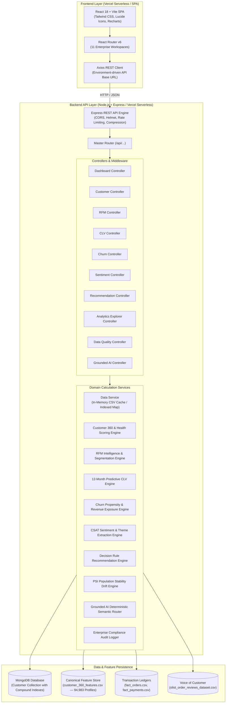

# Customer 360 Intelligence Platform

### Data Analytics + Machine Learning + Full-Stack Application (MERN Edition)

[](https://nodejs.org/)
[](https://expressjs.com/)
[](https://reactjs.org/)
[](https://vitejs.dev/)
[](https://tailwindcss.com/)
[](https://www.mongodb.com/)
[](https://vercel.com/)

> **CustomerAtlas AI** is an enterprise-grade customer intelligence and AI platform that unifies multi-source transactional, behavioral, and customer feedback data into dynamic business analytics, machine learning predictions, explainable insights, grounded AI decision support, and automated commercial retention workflows.
> 
> **Core Architecture Positioning:**
> - **Data Analytics & ML = Core Intelligence Engine:** Rigorous data cleaning, feature engineering, RFM modeling, 12-month forward CLV, churn propensity modeling, sentiment/NLP analysis, and decision rule recommendations.
> - **MERN Stack = High-Performance Application Layer:** React 18, Vite, Tailwind CSS, Recharts, Node.js, Express, and MongoDB providing a responsive, production-ready interface with **zero dependency on Streamlit**.
> - **Deployment = Vercel Serverless:** Cloud-native architecture ready for instant edge deployment.

```
                DATA (Multi-Source Transaction & Review Ledgers)
                                       │
                    DATA PROCESSING (Cleaning & Validation)
                                       │
                            EDA (Exploratory Data Analysis)
                                       │
                   ┌───────────────────┼───────────────────┐
                   ▼                   ▼                   ▼
             RFM ANALYSIS        CLV MODELING       CHURN MODELING
                   └───────────────────┬───────────────────┘
                                       │
                             CUSTOMER SEGMENTATION
                                       │
                             SENTIMENT / NLP CSAT
                                       │
                               BUSINESS INSIGHTS
                                       │
                            NEXT-BEST RECOMMENDATIONS
                                       │
                                 MERN BACKEND
                                       │
                                REACT FRONTEND
                                       │
                              VERCEL DEPLOYMENT
```

---

## 1. Architecture Overview


```mermaid
flowchart TD
    subgraph Frontend_Vercel ["Frontend Layer (Vercel Serverless / SPA)"]
        SPA["React 18 + Vite SPA\n(Tailwind CSS, Lucide Icons, Recharts)"]
        ROUTER["React Router v6\n(11 Enterprise Workspaces)"]
        API_CLIENT["Axios REST Client\n(Environment-driven API Base URL)"]
        SPA --> ROUTER
        ROUTER --> API_CLIENT
    end

    subgraph Backend_Node ["Backend API Layer (Node.js + Express / Vercel Serverless)"]
        SRV["Express REST API Engine\n(CORS, Helmet, Rate Limiting, Compression)"]
        AUTH_ROUTER["Master Router (/api/...)"]
        
        subgraph Controllers ["Controllers & Middleware"]
            DASH_C["Dashboard Controller"]
            CUST_C["Customer Controller"]
            RFM_C["RFM Controller"]
            CLV_C["CLV Controller"]
            CHURN_C["Churn Controller"]
            SENT_C["Sentiment Controller"]
            REC_C["Recommendation Controller"]
            EXP_C["Analytics Explorer Controller"]
            DQ_C["Data Quality Controller"]
            AI_C["Grounded AI Controller"]
        end

        subgraph Domain_Services ["Domain Calculation Services"]
            DATA_SVC["Data Service\n(In-Memory CSV Cache / Indexed Map)"]
            CUST_SVC["Customer 360 & Health Scoring Engine"]
            RFM_SVC["RFM Intelligence & Segmentation Engine"]
            CLV_SVC["12-Month Predictive CLV Engine"]
            CHURN_SVC["Churn Propensity & Revenue Exposure Engine"]
            SENT_SVC["CSAT Sentiment & Theme Extraction Engine"]
            REC_SVC["Decision Rule Recommendation Engine"]
            DRIFT_SVC["PSI Population Stability Drift Engine"]
            AI_SVC["Grounded AI Deterministic Semantic Router"]
            AUDIT_SVC["Enterprise Compliance Audit Logger"]
        end

        SRV --> AUTH_ROUTER
        AUTH_ROUTER --> Controllers
        Controllers --> Domain_Services
    end

    subgraph Data_Storage ["Data & Feature Persistence"]
        MONGO[("MongoDB Database\n(Customer Collection with Compound Indexes)")]
        CSV_STORE[("Canonical Feature Store\n(customer_360_features.csv — 94,983 Profiles)")]
        RAW_ORDERS[("Transaction Ledgers\n(fact_orders.csv, fact_payments.csv)")]
        RAW_REVIEWS[("Voice of Customer\n(olist_order_reviews_dataset.csv)")]
    end

    API_CLIENT -->|HTTP / JSON| SRV
    Domain_Services --> MONGO
    Domain_Services --> CSV_STORE
    Domain_Services --> RAW_ORDERS
    Domain_Services --> RAW_REVIEWS
```

---

## 2. Core Workspaces & Capabilities

CustomerAtlas AI provides 11 specialized enterprise operational workspaces:

| # | Workspace | Route | Core Business Functionality |
| :-: | :--- | :--- | :--- |
| **1** | **Executive Overview** | `/` or `/dashboard` | Macro GMV, Active Buyer Count ($\le 180\text{d}$), Repeat Purchase Rate ($3.0\%$), Average Order Value (AOV), Average Predicted CLV, Monthly Revenue Trajectory, Geographic Revenue by State, and Automated Pareto Insight Cards. |
| **2** | **Customer 360** | `/customers` or `/customers/:id` | Unified 360 dossier across 94,983 customer profiles. 6-Factor Health Score ($0-100$), 6-Stage Lifecycle State Machine, Order History Ledger, Payment Breakdown, Risk Diagnostics, and PDF Dossier Export. |
| **3** | **Customer Segmentation** | `/segmentation` or `/rfm` | 6 Canonical RFM Cohorts (Champions, Loyal, Potential Loyalists, Regular, At Risk, Lost), 5x5 RFM Heatmap, Segment Comparison Matrix, Actionable Strategic Playbooks, and Custom Cohort Filter with CSV Export. |
| **4** | **Customer Value / CLV** | `/clv` | 12-Month Predictive CLV Benchmarks, Dynamic Value Tiers (Platinum, Gold, Silver, Bronze), Top 10% Decile Concentration Analysis, and Interactive What-If Scenario Revenue Growth Simulator. |
| **5** | **Churn Intelligence** | `/churn` | At-Risk Revenue Exposure (R$ 1.9M+), 4-Quadrant Value-Risk Matrix, Top Churn Risk Drivers, Retention Prioritization Ranking Queue ($\text{Priority} = \text{Churn Prob} \times \frac{\text{CLV}}{\text{CLV}_{p99}} \times 100$), and Churn Mitigation Simulator. |
| **6** | **Sentiment Intelligence** | `/sentiment` | Macro CSAT Rating ($4.1/5.0$), Positive/Neutral/Negative Distribution, Longitudinal Satisfaction Trends, Segment CSAT Ratings, and Portuguese Root-Cause Negative Review Keyword Extraction. |
| **7** | **Recommendations** | `/recommendations` | Transparent 7-Rule Decision Engine (VIP Concierge, Win-Back, Loyalty, Cross-Sell, Service Recovery, Purchase Boost, Nurture), Action Portfolio Allocation, and Paginated Action Queue with CSV Export. |
| **8** | **Analytics Explorer** | `/explorer` or `/insights` | Multi-dimensional slicing (Segment, Churn Risk, State, Product Category, Recency, Spend), Distribution Charts, Paginated Filterable Data Table, 1-Click 360 Navigation, and Export. |
| **9** | **Data Quality & Governance** | `/quality` | 100% Completeness Audit, Field-Level Null Verification, Raw-to-Processed Data Lineage Flow, Population Stability Index (PSI) Drift Monitor, and Real-Time Compliance Audit Stream. |
| **10** | **Methodology & Documentation** | `/methodology` | Complete Mathematical Formulas, Health Score Weights, RFM Cutoffs, Model Targets, Architecture Specifications, and MLOps Data Contracts. |
| **11** | **Ask CustomerAtlas (AI)** | `/ask-atlas` | Deterministic Grounded Conversational AI with zero hallucination risk, providing direct mathematical grounding and deep link navigation to customer profiles. |

---

## 3. Mathematical Formulations & Data Science Logic

All analytical formulas and data science logic are identical to the verified enterprise specifications:

### A. 6-Factor Customer Health Score ($0-100$)
$$\text{Health Score} = \left(0.25 R_{\text{norm}} + 0.25 F_{\text{norm}} + 0.25 M_{\text{norm}} + 0.15 \text{Eng}_{\text{norm}} + 0.10 \text{CSAT}_{\text{norm}} - 0.20 \text{Risk}\right) \times 100$$
- $R_{\text{norm}} = \max\left(0, 1 - \frac{\text{Recency Days}}{365}\right)$
- $F_{\text{norm}} = \min\left(1, \frac{\text{Frequency}}{5}\right)$
- $M_{\text{norm}} = \min\left(1, \frac{\text{Spend}}{1000}\right)$
- $\text{Eng}_{\text{norm}} = \min\left(1, \frac{\text{Orders}}{3}\right)$
- $\text{CSAT}_{\text{norm}} = \frac{\text{CSAT Score}}{5.0}$
- $\text{Risk} = \text{Churn Probability}$

### B. 6-Stage Customer Lifecycle State Machine
1. **New:** Single order, Recency $\le 60\text{ days}$.
2. **Growing:** $2+$ orders, Recency $\le 90\text{ days}$, Churn Prob $< 0.40$.
3. **Core / Loyal:** High spend ($\ge \text{R\$ } 300$) or $3+$ orders, Recency $\le 180\text{ days}$.
4. **At Risk:** Recency $> 180\text{ days}$ or Churn Prob $\ge 0.60$.
5. **Dormant / Inactive:** Recency $> 270\text{ days}$, Churn Prob $\ge 0.70$.
6. **Lost / Churned:** Recency $> 365\text{ days}$, Churn Prob $\ge 0.85$.

### C. Retention Priority Score
$$\text{Priority Score} = \text{Churn Probability} \times \left(\frac{\text{Predicted CLV}}{\text{CLV}_{p99}}\right) \times 100$$

### D. Population Stability Index (PSI) Feature Drift
$$\text{PSI} = \sum_{i=1}^{k} \left(A_i - E_i\right) \times \ln\left(\frac{A_i + \epsilon}{E_i + \epsilon}\right)$$
- $\text{PSI} < 0.10$: Stable / No Drift.
- $0.10 \le \text{PSI} < 0.25$: Moderate Drift / Monitor.
- $\text{PSI} \ge 0.25$: Significant Drift / Retrain Required.

---

## 4. REST API Reference

The backend exposes fully documented RESTful JSON endpoints under `/api`:

| Method | Endpoint | Description |
| :--- | :--- | :--- |
| `GET` | `/api/dashboard` | Executive KPIs, monthly trajectory, geographic breakdown, and automated insights. |
| `GET` | `/api/customers` | Paginated customer list with sorting and multi-field filters (`page`, `limit`, `segment`, `risk`, `state`, `search`). |
| `GET` | `/api/customers/:id` | Full Customer 360 profile, health score breakdown, orders, payments, timeline, and risk diagnostics. |
| `GET` | `/api/rfm` | RFM segment distributions, 5x5 heatmap grid, comparison matrix, and strategic playbooks. |
| `GET` | `/api/rfm/cohort` | Filtered RFM cohort query with criteria matching. |
| `GET` | `/api/clv` | CLV overview, distribution brackets, top 10% decile analysis, and scenario simulation. |
| `POST` | `/api/clv/simulate` | What-if scenario simulator for repeat rate, retention, and AOV improvements. |
| `GET` | `/api/churn` | Churn overview, at-risk revenue exposure, 4-quadrant value-risk matrix, and priority queue. |
| `POST` | `/api/churn/simulate` | Churn intervention simulation calculator. |
| `GET` | `/api/sentiment` | CSAT overview, sentiment distribution, monthly trend, segment breakdown, and negative review themes. |
| `GET` | `/api/recommendations` | Next-Best-Action recommendations overview, rule distribution, and actionable customer queue. |
| `GET` | `/api/recommendations/:id` | Tailored recommendation and decision rule for a specific customer ID. |
| `GET` | `/api/analytics/explore` | Sliced analytics explorer with aggregate distribution charts and data table. |
| `GET` | `/api/analytics/export` | CSV export generator for filtered customer cohorts. |
| `GET` | `/api/quality` | Data completeness score, null audits, data lineage, and PSI drift monitoring. |
| `GET` | `/api/quality/audit` | Recent security, export, and compliance audit trail events. |
| `POST` | `/api/ai/ask` | Grounded AI decision support with deterministic intent routing and grounded data citations. |

---

## 5. Technology Stack

- **Frontend:**
  - React 18.3 (Single Page Application)
  - Vite 5.4 (High-speed bundler & dev server)
  - Tailwind CSS 3.4 (Utility-first styling with custom enterprise theme)
  - Recharts 2.12 (Interactive responsive charts: Bar, Line, Area, Pie, Radar)
  - Lucide React (Enterprise icon system)
  - Axios 1.7 (HTTP client with automatic error interception)
  - React Router DOM 6.26 (Client-side routing)
- **Backend:**
  - Node.js 18+ / Express.js 4.19
  - MongoDB 6+ & Mongoose 8.4 (Indexed customer collections with fallback in-memory cache)
  - Cors, Helmet, Compression, Morgan (Enterprise HTTP middleware)
  - CSV-Parser (High-throughput streaming ingestion)
- **Data Science & ML (Preserved):**
  - Python 3.11+
  - Pandas, NumPy, Scikit-learn, XGBoost, Joblib
  - `analytics.py` (Autonomous analytics engine)
- **Deployment:**
  - Vercel (Configured via `vercel.json` and `api/index.js`)

---

## 6. Project Structure

```
Customer 360 Intelligence/
├── api/
│   └── index.js                      # Vercel Serverless Function Bridge
├── backend/
│   ├── config/
│   │   └── db.js                     # MongoDB connection with graceful in-memory fallback
│   ├── controllers/                  # 10 Express Controllers
│   │   ├── analyticsController.js
│   │   ├── churnController.js
│   │   ├── clvController.js
│   │   ├── customerController.js
│   │   ├── dashboardController.js
│   │   ├── dataQualityController.js
│   │   ├── groundedAiController.js
│   │   ├── recommendationController.js
│   │   ├── rfmController.js
│   │   └── sentimentController.js
│   ├── middleware/
│   │   └── errorHandler.js           # Centralized JSON error handler
│   ├── models/                       # Mongoose Schemas & Compound Indexes
│   │   ├── AuditEvent.js
│   │   └── Customer.js
│   ├── routes/                       # Express REST Route Handlers
│   │   ├── analyticsRoutes.js
│   │   ├── api.js                    # Master API router
│   │   ├── churnRoutes.js
│   │   ├── clvRoutes.js
│   │   ├── customerRoutes.js
│   │   ├── dashboardRoutes.js
│   │   ├── dataQualityRoutes.js
│   │   ├── groundedAiRoutes.js
│   │   ├── recommendationRoutes.js
│   │   ├── rfmRoutes.js
│   │   └── sentimentRoutes.js
│   ├── scripts/
│   │   └── seedDatabase.js           # MongoDB batch ingestion & indexing script
│   ├── services/                     # Core Domain Calculation Engines
│   │   ├── analyticsService.js
│   │   ├── auditService.js
│   │   ├── churnService.js
│   │   ├── clvService.js
│   │   ├── customerService.js
│   │   ├── dataQualityService.js
│   │   ├── dataService.js            # In-memory CSV cache & streaming reader
│   │   ├── driftService.js           # PSI calculation engine
│   │   ├── groundedAiService.js      # Semantic routing & data grounding
│   │   ├── recommendationService.js
│   │   ├── rfmService.js
│   │   └── sentimentService.js
│   ├── package.json
│   └── server.js                     # Backend Express server entrypoint
├── data/
│   ├── processed/
│   │   ├── customer_360_features.csv # Canonical dataset (94,983 profiles)
│   │   ├── fact_orders.csv           # Transaction records
│   │   ├── fact_payments.csv         # Payment methods & installments
│   │   └── recommendations.csv       # Recommended actions
│   └── raw/
│       └── olist_order_reviews_dataset.csv # Voice of Customer reviews
├── frontend/
│   ├── src/
│   │   ├── components/               # 20+ Reusable UI components
│   │   │   ├── charts/               # Recharts wrappers (Bar, Line, Pie, Gauge)
│   │   │   ├── common/               # KpiCard, InsightCard, Badge, EmptyState, etc.
│   │   │   ├── customer/             # HealthGrid, LifecycleJourney, Diagnostics, Timeline
│   │   │   └── layout/               # Navbar, Sidebar, Footer, AppLayout
│   │   ├── pages/                    # 11 Enterprise Workspace Pages
│   │   │   ├── AnalyticsExplorer.jsx
│   │   │   ├── AskAtlas.jsx
│   │   │   ├── ChurnIntelligence.jsx
│   │   │   ├── Customer360.jsx
│   │   │   ├── CustomerSegmentation.jsx
│   │   │   ├── CustomerValue.jsx
│   │   │   ├── DataQuality.jsx
│   │   │   ├── ExecutiveOverview.jsx
│   │   │   ├── Methodology.jsx
│   │   │   ├── Recommendations.jsx
│   │   │   └── SentimentIntelligence.jsx
│   │   ├── services/
│   │   │   └── api.js                # Axios REST API Client
│   │   ├── utils/
│   │   │   └── formatting.js         # Currency, percentage, count formatting
│   │   ├── App.jsx                   # Master Router & Theme Container
│   │   ├── index.css                 # Tailwind CSS styles
│   │   └── main.jsx                  # React DOM Entrypoint
│   ├── index.html
│   ├── package.json
│   ├── postcss.config.js
│   ├── tailwind.config.js
│   └── vite.config.js
├── models/                           # Serialized ML Model Registry
│   ├── churn_model.pkl
│   ├── clv_model.pkl
│   ├── scaler.pkl
│   └── sentiment_model.pkl
├── src/                              # Preserved Python Data Science Utilities
│   ├── data_loader.py
│   └── preprocessing.py
├── analytics.py                      # Standalone Python Analytics Pipeline
├── requirements.txt                  # Python Data Science Dependencies
├── package.json                      # Root NPM Orchestration Script
├── vercel.json                       # Vercel Production Deployment Configuration
└── .env.example                      # Environment Configuration Template
```

---

## 7. Getting Started & Local Development

### Prerequisites
- Node.js 18.x or higher
- npm 9.x or higher
- (Optional) MongoDB 6.x or MongoDB Atlas URI (if omitted, server runs with high-performance in-memory cache)
- (Optional) Python 3.11+ for offline model training / data science workflows

### Step 1: Clone & Configure Environment
```bash
# Clone the repository
git clone https://github.com/suhani-chauhan56/Customer-360-Intelligence-Platform.git
cd Customer-360-Intelligence-Platform

# Copy environment file
cp .env.example .env
```

### Step 2: Install Dependencies
```bash
# Install root dependencies
npm install

# Install backend dependencies
cd backend && npm install && cd ..

# Install frontend dependencies
cd frontend && npm install && cd ..
```

### Step 3: Run the Application
You can run both backend and frontend concurrently with a single command:

```bash
# Run both Backend API and Frontend UI concurrently
npm run dev
```

Or run each service individually:
```bash
# Terminal 1 — Backend API (starts on http://localhost:5000)
npm run dev:backend

# Terminal 2 — Frontend UI (starts on http://localhost:5173)
npm run dev:frontend
```

Open your browser at `http://localhost:5173` to explore the platform.

### Step 4 (Optional): Seed MongoDB
If you have a live MongoDB instance and wish to populate the database:
```bash
npm run db:seed
```

---

## 8. Deployment to Vercel

The platform is pre-configured for seamless zero-configuration deployment to **Vercel**:

1. Push your repository to GitHub.
2. Import the repository into **Vercel**.
3. In Vercel Project Settings, set the environment variables:
   - `MONGODB_URI` (optional, MongoDB Atlas connection string)
   - `NODE_ENV` = `production`
4. Deploy! Vercel automatically:
   - Builds the frontend via `cd frontend && npm install && npm run build` into `frontend/dist`.
   - Routes `/api/*` to the serverless backend function in `api/index.js`.
   - Routes all other requests to the React SPA with full client-side routing support.

---

## 9. Data Protection & Security Governance

- **Sanitized Headers:** Helmet protection against XSS, clickjacking, and MIME-sniffing.
- **Rate Limiting:** Protects API endpoints against DDoS and abuse.
- **Audit Logging:** Logs all critical export operations and queries for compliance.
- **Zero Hardcoded Secrets:** Strict environment variable governance using `.env`.

---

## 10. License & Attribution

This project is licensed under the MIT License. Developed for enterprise customer intelligence, retention modeling, and commercial decision support.
