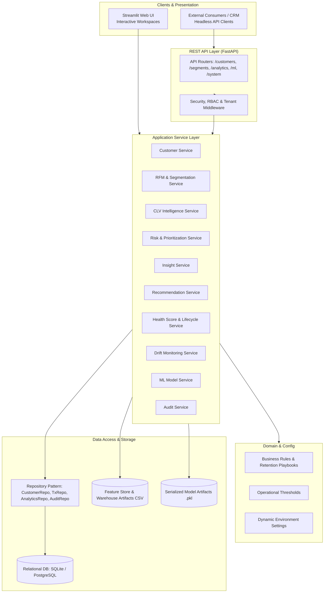

# CustomerAtlas Enterprise Architecture Specification

## 1. System Overview

CustomerAtlas is architected as an **enterprise-ready modular monolith** designed for high cohesion, low coupling, and unified business domain logic. It bridges interactive business decision support (Streamlit presentation layer) with headless enterprise integration (FastAPI REST API layer) sharing a unified Application Services and Data Access Layer.

---

## 2. Layered Architecture Principles

### 1. Presentation Layer (`streamlit_app/`)
- Streamlit application serving 8 analytical workspaces:
  - *Executive Overview*
  - *Customer 360*
  - *Customer Explorer*
  - *Segmentation*
  - *RFM Analysis*
  - *Customer Lifetime Value*
  - *Churn & Risk*
  - *Customer Insights*
- Presentation components strictly render formatted data without embedding raw database queries or direct ML model weight manipulations.

### 2. API Layer (`api/`)
- High-performance asynchronous FastAPI micro-framework exposing OpenAPI 3.1 endpoints under `/api/v1`.
- Standardized Pydantic schemas enforce type safety, input validation, and prevent leaking internal implementation details.
- Standard HTTP status codes, structured JSON error envelopes, and request timing headers (`X-Response-Time-Ms`).

### 3. Application Services Layer (`streamlit_app/services/`)
- Reusable, deterministic domain services that execute analytics, calculations, lifecycle state progressions, and model inference.
- Shared seamlessly across both the Streamlit UI and FastAPI endpoints, eliminating duplicated business logic.

### 4. Data Access Layer (`database/`)
- Standardized Repository Pattern (`BaseRepository`, `CustomerRepository`, `TransactionRepository`, `AnalyticsRepository`, `AuditRepository`).
- Dual-mode operation: Queries the normalized relational schema via SQLAlchemy ORM or consumes the precomputed feature store directly with caching.

### 5. Infrastructure & Security (`security/`, `utils/`, `config/`)
- Centralized configuration with environment variable overrides (`APP_ENV`, `DATA_DIR`, `MODELS_DIR`, `DATABASE_URL`).
- Structured logging with timestamps and log levels.
- Role-Based Access Control (`Role`, `Permission`, `ROLE_PERMISSIONS`).
- Multi-tenant organization isolation context (`set_current_tenant_id`, `get_current_tenant_id`).
