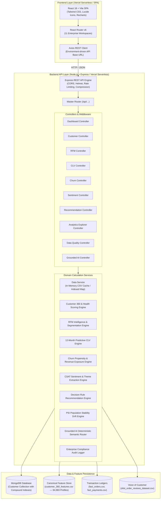

# CustomerAtlas Enterprise Architecture Specification

## 1. System Overview

CustomerAtlas is architected as an **enterprise-ready production platform** migrated to a high-performance **MERN web architecture** (React 18, Vite, Tailwind CSS, Recharts, Node.js, Express, MongoDB) designed for full Vercel serverless and cloud deployment with **zero dependency on Streamlit**.

```mermaid
flowchart TD
    subgraph Frontend_Vercel ["Frontend Layer (Vercel Serverless / SPA)"]
        SPA["React 18 + Vite SPA\n(Tailwind CSS, Lucide Icons, Recharts)"]
        ROUTER["React Router v6\n(11 Enterprise Workspaces)"]
        API_CLIENT["Axios REST Client\n(Environment-driven API Base URL)"]
        SPA --> ROUTER
        ROUTER --> API_CLIENT
    end

    subgraph Backend_Node ["Backend API Layer (Node.js + Express / Vercel Serverless)"]
        SRV["Express REST API Engine\n(CORS, Helmet, Rate Limiting, Compression)"]
        AUTH_ROUTER["Master Router (/api/...)"]
        
        subgraph Controllers ["Controllers & Middleware"]
            DASH_C["Dashboard Controller"]
            CUST_C["Customer Controller"]
            RFM_C["RFM Controller"]
            CLV_C["CLV Controller"]
            CHURN_C["Churn Controller"]
            SENT_C["Sentiment Controller"]
            REC_C["Recommendation Controller"]
            EXP_C["Analytics Explorer Controller"]
            DQ_C["Data Quality Controller"]
            AI_C["Grounded AI Controller"]
        end

        subgraph Domain_Services ["Domain Calculation Services"]
            DATA_SVC["Data Service\n(In-Memory CSV Cache / Indexed Map)"]
            CUST_SVC["Customer 360 & Health Scoring Engine"]
            RFM_SVC["RFM Intelligence & Segmentation Engine"]
            CLV_SVC["12-Month Predictive CLV Engine"]
            CHURN_SVC["Churn Propensity & Revenue Exposure Engine"]
            SENT_SVC["CSAT Sentiment & Theme Extraction Engine"]
            REC_SVC["Decision Rule Recommendation Engine"]
            DRIFT_SVC["PSI Population Stability Drift Engine"]
            AI_SVC["Grounded AI Deterministic Semantic Router"]
            AUDIT_SVC["Enterprise Compliance Audit Logger"]
        end

        SRV --> AUTH_ROUTER
        AUTH_ROUTER --> Controllers
        Controllers --> Domain_Services
    end

    subgraph Data_Storage ["Data & Feature Persistence"]
        MONGO[("MongoDB Database\n(Customer Collection with Compound Indexes)")]
        CSV_STORE[("Canonical Feature Store\n(customer_360_features.csv — 94,983 Profiles)")]
        RAW_ORDERS[("Transaction Ledgers\n(fact_orders.csv, fact_payments.csv)")]
        RAW_REVIEWS[("Voice of Customer\n(olist_order_reviews_dataset.csv)")]
    end

    API_CLIENT -->|HTTP / JSON| SRV
    Domain_Services --> MONGO
    Domain_Services --> CSV_STORE
    Domain_Services --> RAW_ORDERS
    Domain_Services --> RAW_REVIEWS
```

---

## 2. Layered Architecture Principles

### 1. Presentation Layer (`frontend/`)
- React 18 SPA serving 11 analytical workspaces:
  - *Executive Overview*
  - *Customer 360*
  - *Customer Segmentation*
  - *Customer Value (CLV)*
  - *Churn Intelligence*
  - *Sentiment Intelligence*
  - *Recommendations*
  - *Analytics Explorer*
  - *Data Quality & Governance*
  - *Methodology & Contracts*
  - *Ask CustomerAtlas (Grounded AI)*

### 2. Backend REST API Layer (`backend/` & `api/`)
- Express REST API engine deployed on Node.js / Vercel Serverless Function bridge (`api/index.js`).
- Clean separation between routing, validation controllers, and domain services.

### 3. Application Services & Data Science Layer (`services/`, `analytics.py`, `src/`)
- Reusable, deterministic domain services that execute analytics, calculations, lifecycle state progressions, and ML model inference.
- Preserved Python Analytics Engine and standalone CLI pipeline.

### 4. Data Access Layer (`data/`, `database/`, MongoDB)
- Canonical CSV feature store (`customer_360_features.csv` — 94,983 profiles).
- MongoDB collection support with automatic fallback to high-performance in-memory cache.
