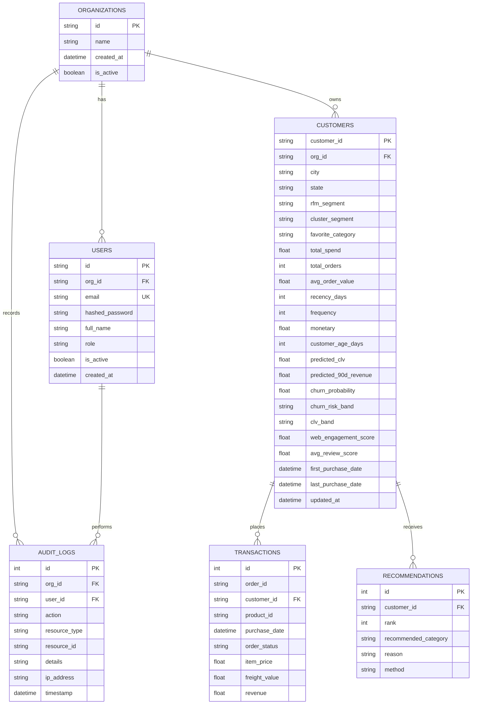

# CustomerAtlas Relational Database Architecture

## 1. Overview

CustomerAtlas supports a relational database layer powered by **SQLAlchemy ORM** compatible with **SQLite** (local / embedded development) and **PostgreSQL** (production cloud deployments).

---

## 2. Entity-Relationship Schema



---

## 3. Database Indexes

To maintain sub-50ms query response times over large customer datasets, the schema enforces composite and single-column indexes:

| Table | Index Name | Columns | Purpose |
|---|---|---|---|
| `customers` | `ix_customers_customer_id` | `customer_id` | Primary Key & Instant Profile Lookup |
| `customers` | `ix_cust_org_segment` | `org_id, rfm_segment` | Fast Segment Partition Filtering |
| `customers` | `ix_cust_org_churn` | `org_id, churn_probability` | Rapid At-Risk Prioritization Querying |
| `customers` | `ix_cust_org_clv` | `org_id, predicted_clv` | High-Value Cohort Extraction |
| `transactions` | `ix_tx_cust_date` | `customer_id, purchase_date` | Ordered Customer Transaction Timelines |
| `audit_logs` | `ix_audit_org_timestamp` | `org_id, timestamp` | Compliance Time-Series Range Scans |

---

## 4. Seeding & Migrations

- **Database Initialization:** Run `python database/seed.py` to auto-create all tables and seed 5,000 canonical profiles from `data/processed/customer_360_features.csv`.
- **Alembic Readiness:** The SQLAlchemy declarative models inherit from `database.connection.Base`, making Alembic migration generation seamless:
  ```bash
  alembic revision --autogenerate -m "Initial enterprise schema"
  alembic upgrade head
  ```
