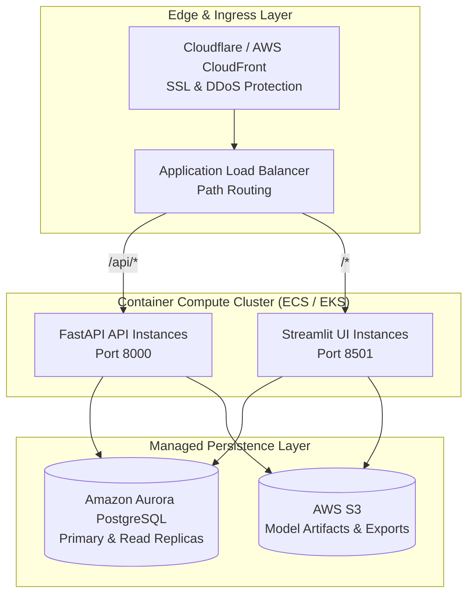

# CustomerAtlas Enterprise Deployment & Scalability Architecture

## 1. Cloud Architecture

CustomerAtlas is designed for flexible cloud hosting:

---

## 2. Horizontal & Vertical Scaling

1. **Stateless API Layer:** FastAPI instances can scale horizontally behind an ALB based on CPU utilization and request concurrency.
2. **Database Read Replicas:** Read-heavy analytical workloads (e.g., segment aggregations, explorer filtering) route to PostgreSQL read replicas.
3. **Streamlit Connection Pooling:** Streamlit UI instances leverage SQLAlchemy connection pooling (`pool_size=10, max_overflow=20`).
4. **Caching:** Dataset caching (`@st.cache_data`) and model resource caching (`@st.cache_resource`) minimize repeated computations.
