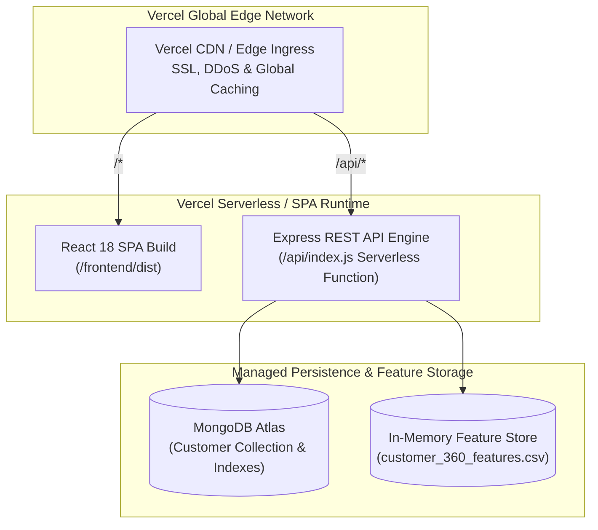

# CustomerAtlas Enterprise Deployment & Scalability Architecture

## 1. Production Architecture (MERN + Vercel)

CustomerAtlas is optimized for cloud-native deployment via **Vercel** serverless functions and modern container environments:

```mermaid
flowchart TD
    subgraph Edge["Vercel Global Edge Network"]
        CDN["Vercel CDN / Edge Ingress\nSSL, DDoS & Global Caching"]
    end

    subgraph Serverless["Vercel Serverless / SPA Runtime"]
        SPA["React 18 SPA Build\n(/frontend/dist)"]
        API_FN["Express REST API Engine\n(/api/index.js Serverless Function)"]
    end

    subgraph Persistence["Managed Persistence & Feature Storage"]
        MONGO[("MongoDB Atlas\n(Customer Collection & Indexes)")]
        CANONICAL[("In-Memory Feature Store\n(customer_360_features.csv)")]
    end

    CDN -->|/*| SPA
    CDN -->|/api/*| API_FN
    API_FN --> MONGO
    API_FN --> CANONICAL
```

---

## 2. Horizontal & Vertical Scaling

1. **Vercel Serverless Execution:** Backend REST API routes run as auto-scaling serverless Node.js functions with instant horizontal elasticity.
2. **SPA Client Performance:** React frontend assets are pre-rendered into static chunks and distributed globally across Vercel's edge network.
3. **In-Memory Streaming Fallback:** High-performance in-memory indexed store handles sub-50ms analytics responses across 94,983 customer profiles.
4. **Database Indexing:** Compound indexes on `customer_id`, `rfm_segment`, `churn_probability`, `predicted_clv`, and `state` ensure query efficiency.
