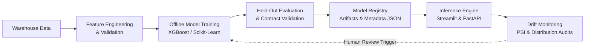

# CustomerAtlas MLOps & Governance Specification

## 1. Machine Learning Lifecycle

CustomerAtlas manages predictive models through a structured MLOps lifecycle separating offline training, validation, artifact registration, online inference, and drift monitoring:

---

## 2. Model Registry & Provenance

Every deployed model artifact is tracked via JSON metadata in `models/metadata/`:

| Model Task | Version | Framework | Input Features | Key Metric | Target Variable |
|---|---|---|---|---|---|
| **Churn Propensity** | `1.0.0` | XGBoost Classifier | `recency_days, frequency, monetary, avg_order_value, number_of_products, customer_age_days` | $\text{ROC-AUC: } 0.666$ | `calibrated_churn_label` |
| **12-Month Forward CLV** | `1.0.0` | XGBoost Regressor | `recency_days, frequency, monetary, avg_order_value, number_of_products, customer_age_days` | $R^2: 0.918 \;\vert\; \text{MAE: } 38.15\text{ R\$}$ | `predicted_12m_clv_brl` |
| **Behavioral Clustering** | `1.0.0` | K-Means Pipeline | `recency, frequency, monetary, web_engagement` | 5 Clusters | `cluster_segment` |
| **Review Sentiment** | `1.0.0` | TF-IDF + Logistic | Review Text Tokens | $\text{Weighted F1: } 0.883$ | `sentiment_label` |

---

## 3. Data & Prediction Drift Monitoring

### Population Stability Index (PSI)
Drift is computed using Population Stability Index across 10 quantile bins:
$$\text{PSI} = \sum \left( P_i - Q_i \right) \times \ln\left(\frac{P_i}{Q_i}\right)$$

| PSI Value | Classification | Operational Policy |
|---|---|---|
| $\text{PSI} < 0.10$ | **Stable 🟢** | No action required. Model assumptions intact. |
| $0.10 \le \text{PSI} < 0.25$ | **Moderate Shift 🟡** | Flag for data science review during weekly triage. |
| $\text{PSI} \ge 0.25$ | **Significant Drift 🔴** | Alert triggered. Human audit required prior to scheduled retraining. |

> **Governance Policy:** CustomerAtlas never implements blind automated retraining. Significant drift triggers an engineering alert and dataset audit to ensure data quality issues (e.g. upstream pipeline failure) are not mistaken for legitimate customer behavior evolution.

---

## 4. Model Explainability 2.0

CustomerAtlas separates global model feature rankings from individual customer attribution factors:

1. **Global Explanations:** Relative feature importance weights derived from XGBoost split gain metrics.
2. **Local Attributions:** Evidence-based profile factors (e.g., Inactivity duration $>180$ days, negative CSAT review rating).
3. **Responsible Attribution Phrasing:** The platform explicitly notes:
   > *"These features contributed to the statistical model estimate; factors represent observed correlations rather than direct causal certainty."*
